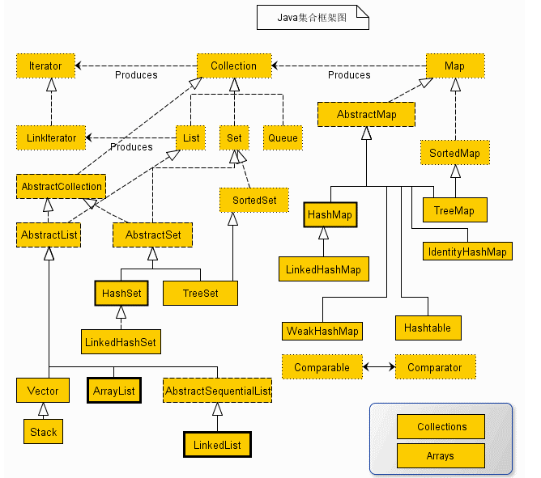
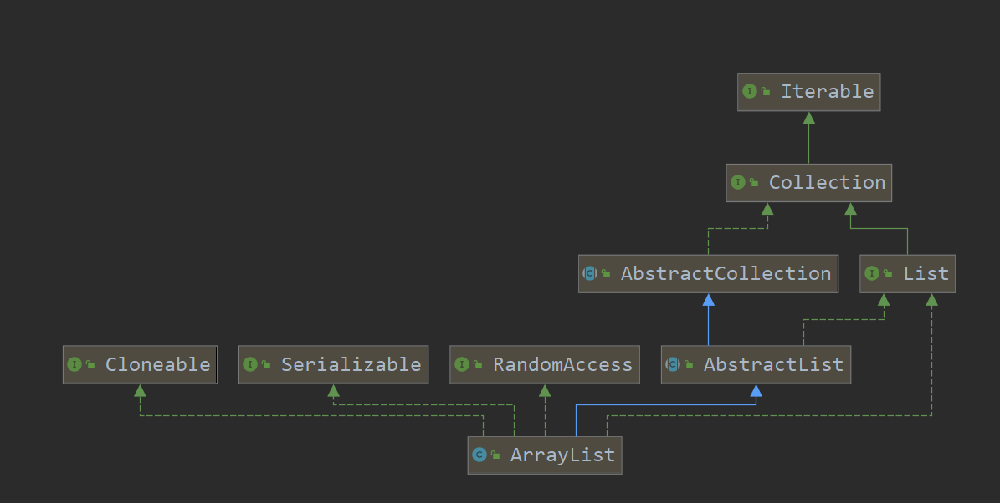
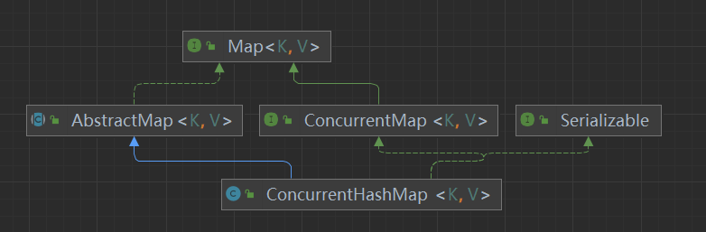

# java集合

## 1. 概述

* java中集合
* 

## 2. List

### 2.1. ArrayList

* ArrayList 类是一个可以动态修改的数组，与普通数组的区别就是它是没有固定大小的限制，我们可以添加或删除元素。ArrayList 继承了 AbstractList ，并实现了 List 接口



#### 2.1.1. 初始化

*  ArrayList底层维护的是一个数组，创建时候可指定数据长度，如果没有指定，将初始化成一个空数组

  ~~~java
  /**
   * Shared empty array instance used for default sized empty instances. We
   * distinguish this from EMPTY_ELEMENTDATA to know how much to inflate when
   * first element is added.
   */
  private static final Object[] DEFAULTCAPACITY_EMPTY_ELEMENTDATA = {};
  /**
   * Constructs an empty list with an initial capacity of ten.
   */
  public ArrayList() {
      this.elementData = DEFAULTCAPACITY_EMPTY_ELEMENTDATA;
  }
  ~~~

  

#### 2.1.2. 添加元素

* add()
  
~~~java
    public boolean add(E e) {
        // 确保内部容量
        ensureCapacityInternal(size + 1);  // Increments modCount!!
        elementData[size++] = e;
        return true;
    }
    // 确保内部容量
    private void ensureCapacityInternal(int minCapacity) {
        ensureExplicitCapacity(calculateCapacity(elementData, minCapacity));
    }
    //计算容量
    private static int calculateCapacity(Object[] elementData, int minCapacity) {
        //空数组时候，去默认容量和最小所需容量的最大值
        if (elementData == DEFAULTCAPACITY_EMPTY_ELEMENTDATA) {
            return Math.max(DEFAULT_CAPACITY, minCapacity);
        }
        // 否则直接返回最小所需容量
        return minCapacity;
    }
    // 确保显式容量
    private void ensureExplicitCapacity(int minCapacity) {
        modCount++;

        // 最小所需容量大于当前数据容量时候，就要扩容
        if (minCapacity - elementData.length > 0)
            grow(minCapacity);
    }
    
~~~

* 确保空间可用

    * 数组每次扩容， 新的数据长度 = oldCapacity + (oldCapacity >> 1)，即加上元数组长度的一半向下取整
    
    ~~~java
      private void grow(int minCapacity) {
          // overflow-conscious code
          int oldCapacity = elementData.length;
          int newCapacity = oldCapacity + (oldCapacity >> 1);
          if (newCapacity - minCapacity < 0)
            newCapacity = minCapacity;
          if (newCapacity - MAX_ARRAY_SIZE > 0)
            newCapacity = hugeCapacity(minCapacity);
          // minCapacity is usually close to size, so this is a win:
          elementData = Arrays.copyOf(elementData, newCapacity);
      }
    ~~~

### 2.2. LinkedList

* LinkedList底层是一个双向链表，所以不存在扩容等问题，元素的添加效率高，但是检索效率低

#### 2.2.1. 获取指定位置元素get(int index)

* 判断元素与集合大小的关系，决定从前往后找还是从后往前找
  
~~~java

    public E get(int index) {
        checkElementIndex(index);
        return node(index).item;
    }

    Node<E> node(int index) {
        // 小于集合大小的一半，从前往后找
        if (index < (size >> 1)) {
            Node<E> x = first;
            for (int i = 0; i < index; i++)
                x = x.next;
            return x;
        } else {
            // 小于集合大小的一半，从后往前找
            Node<E> x = last;
            for (int i = size - 1; i > index; i--)
                x = x.prev;
            return x;
        }
    }
~~~

#### 2.2.2. 删除

* 找到指定位置元素，并删除


### 2.3. 比较

| 集合类型   | 底层实现 | 特征 |
| ---------- | -------- | ---- |
| ArrayList  | 数组     |   数据存放在连续的内存空间上的    |
| LinkedList | 双向链表 |   数据不是存放在连续的内存空间上的   |


## 3. Set

### 3.1. HashSet

* HashSet的底层实现是一个HashMap，添加元素时，将要添加的元素作为key,且定义一个默认的对象作为value，并调用HashMap的put方法，利用HashMap的特性，以实现去重。

### 3.2. LinkedHashSet

* LinkedHashSet是HashSet的一个子类，其实现是LinkedHashMap

### 3.3. TreeSet


## 4. Queue


## 5. Map

### 5.1. HashMap

#### 5.1.1. 重要属性

* loadFactor： 加载因子

* DEFAULT_LOAD_FACTOR：默认加载因子 0.75

#### 5.1.2. 重要方法
* 初始化
* put(K key, V value) 
	* 基本流程
		1. 计算key的hashCode值并转换，记为hash，做了一些特殊处理，
        ~~~java
        
        /**
        * 异或运算：第一个操作数的的第n位于第二个操作数的第n位相反，那么结果的第n为也为1，否则为0
        * 0^0=0；  0^1=1；  1^0=1；   1^1=0；
        * 48612937
        * 0000001011100101 1100011001001001
        * 0000000000000000 0000001011100101
        * 0000001011100101 1100010010101100
        * hashCode值右移16位再与其hashCode值做异或运算，保证结果值与原值的前16位相同，后16为与原值的钱16位为异或关系
		    */
		    (key == null) ? 0 : (h = key.hashCode()) ^ (h >>> 16)
		    
        ~~~

		2. 根据hash值，计算数组下标
      * 计算公式：(n - 1) & hash，其中n为当前数组的长度（注意理解n为什么会是2的次幂），初始容积是 1<<4 = 16
      ~~~java
      /**
      * 按位与运算 & 0&0=0;  0&1=0;   1&0=0;    1&1=1;
      * 00000010111001011100010010101100
      * 00000000000000000000000000011111  (16-1=15)
      * 00000000000000000000000000001100
      * 与运算保证了数组下标不超过数组最大范围，同时数据长度为2的次幂，会使得所有元素在数组中分布更加均匀
      */
      int index = (n - 1) & hash;
    
      ~~~

		3. 判断数组对应位置的值（记为p）是否为null，如果为null，创建新的Node对象，并赋值给数组对应下标上的值，跳过下一步。如果不为null，进行下一步处理
		
		4. 如果p节点保存的hash值等于key的hash且（key=p节点保存的key 或者 key.equals(p节点保存的key)）
		5. 判断是否为树节点，树节点则插入树中，否则插入链表中，链表长度大于等于8时，将其转换成红黑树
		6. 当数据个数大于一定阀值的时候，进行扩容，扩容后的长度是原来的2倍


* get 

#### 5.1.3. 问题

1. 在计算数组下标时候，为什么要右移16位再做异或运算
 
* 总结回答：是为了提高性能，在计算数组下标时，将高位的影响扩展到低位，从而较少哈希碰撞，提高性能

~~~java

    /**
     * 计算key.hashCode()并将较高的散列位扩展(XORs)到较低的散列位。
     * 因为该表使用二次方掩码，所以在当前掩码之上仅位不同的哈希集总是会发生碰撞。(已知的例子包括在小表格中保存连续整数的Float键集。)
     *  2	1073741824	1000000000000000000000000000000
     *  3	1077936128	1000000010000000000000000000000
     *  4	1082130432	1000000100000000000000000000000
     *  5	1084227584	1000000101000000000000000000000
     *  6	1086324736	1000000110000000000000000000000
     *  7	1088421888	1000000111000000000000000000000
     *  8	1090519040	1000001000000000000000000000000
     *  9	1091567616	1000001000100000000000000000000
     *  10	1092616192	1000001001000000000000000000000
     * 因此，我们应用了一种转换，将更高位的影响向下扩散。
     * 比特传播的速度、效用和质量之间需要权衡。
     * 因为许多常见的哈希集已经合理分布了(所以不能从扩展中获益)，
     * 而且因为我们使用树来处理箱子中的大型碰撞集，
     * 我们只是用最便宜的方式异或一些移位的位来减少系统损失，以及合并最高位的影响，
     * 否则由于表边界的原因，索引计算中永远不会使用最高位。
     */    
    static final int hash(Object key) {
        int h;
        return (key == null) ? 0 : (h = key.hashCode()) ^ (h >>> 16);
    }
~~~


2. hashMap的数组长度为什么保持2的次幂

* 总结回答：为了提高性能，hashMap底层是数组+链表+红黑树的实现方式，第一层是数组，存放逻辑是：会根据key的hashCode值算出对应的下标，将值存放到对应位置上去，数组长度保持2的次幂，**是为了使得所有元素在数组中分布更加均匀**，以减少红黑树（链表）中查找元素时数据比较的次数，从而达到提高新能的目的

* hashMap的数组长度一定保持2的次幂，比如16的二进制表示为 10000，那么length-1就是15，二进制为01111，同理扩容后的数组长度为32，二进制表示为100000，length-1为31，二进制表示为011111。
  这样会保证低位全为1，而扩容后只有一位差异，也就是多出了最左位的1，这样在通过 h&(length-1)的时候，只要h对应的最左边的那一个差异位为0，就能保证得到的新的数组索引和老数组索引一致(大大减少了之前已经散列良好的老数组的数据位置重新调换)，还有，数组长度保持2的次幂，length-1的低位都为1，会使得获得的数组索引index更加均匀。
  
  ```java
  static int indexFor(int h, int length) {  
           return h & (length-1);  
  }
  ```
  首先算得key得hashcode值，然后跟数组的长度-1做一次“与”运算（&）。看上去很简单，其实比较有玄机。比如数组的长度是2的4次方，那么hashcode就会和2的4次方-1做“与”运算。很多人都有这个疑问，
  为什么hashmap的数组初始化大小都是2的次方大小时，hashmap的效率最高，我以2的4次方举例，来解释一下为什么数组大小为2的幂时hashmap访问的性能最高。 
  看下图，左边两组是数组长度为16（2的4次方），右边两组是数组长度为15。两组的hashcode均为8和9，但是很明显，当它们和1110“与”的时候，产生了相同的结果，也就是说它们会定位到数组中的同
  一个位置上去，这就产生了碰撞，8和9会被放到同一个链表上，那么查询的时候就需要遍历这个链表，得到8或者9，这样就降低了查询的效率。同时，我们也可以发现，当数组长度为15的时候，hashcode的hashMap的数组长度为什么保持2的次幂
  值会与14（1110）进行“与”，那么最后一位永远是0，而0001，0011，0101，1001，1011，0111，1101这几个位置永远都不能存放元素了，空间浪费相当大，更糟的是这种情况中，数组可以使用的位置比数组
  
  长度小了很多，这意味着进一步增加了碰撞的几率，减慢了查询的效率！
  
  
  
  所以说，当数组长度为2的n次幂的时候，不同的key算得得index相同的几率较小，那么数据在数组上分布就比较均匀，也就是说碰撞的几率小，相对的，查询的时候就不用遍历某个位置上的链表，这样查询效率也就较高了。 
  
  说到这里，我们再回头看一下hashmap中默认的数组大小是多少，查看源代码可以得知是16，为什么是16，而不是15，也不是20呢，看到上面的解释之后我们就清楚了吧，显然是因为16是2的整数次幂的原因，
  
  在小数据量的情况下16比15和20更能减少key之间的碰撞，而加快查询的效率。

3. HashMap的扩容机制

4. hashMap是线程安全的吗？不安全体现在哪里？

答：不是线程安全的，不安全主要体现在put的时候，可能会出现带环链表，再下次get时就会出现死循环

5. 要实现安全的Map有几种方式？各有什么优缺点

* hashTable
* Collections.synchronizedMap()
* ConcurrentHashMap


### 5.2. LinkedHashMap

* LinkedHashMap是HashMap的一个子类，相对于HashMap，其维护了一个基于Entry的双向列表，保存了存入集合中数据的顺序，

* LinkedHashMap提供了一个基于Map.Entry的LinkedHashMap.Entry，添加了before和after属性，组成了双向列表

  ~~~java
      /**
       * HashMap.Node subclass for normal LinkedHashMap entries.
       */
      static class Entry<K,V> extends HashMap.Node<K,V> {
          Entry<K,V> before, after;
          Entry(int hash, K key, V value, Node<K,V> next) {
              super(hash, key, value, next);
          }
      }
  ~~~
  
* LinkedHashMap重写了HashMap的newNode方法，在创建节点后，调用了linkNodeLast()方法，将当前put的数据链接到链表的最后面

  ~~~java
  Node<K,V> newNode(int hash, K key, V value, Node<K,V> e) {
      LinkedHashMap.Entry<K,V> p =
          new LinkedHashMap.Entry<K,V>(hash, key, value, e);
      linkNodeLast(p);
      return p;
  }
  // link at the end of list
  private void linkNodeLast(LinkedHashMap.Entry<K,V> p) {
      LinkedHashMap.Entry<K,V> last = tail;
      tail = p;
      if (last == null)
          head = p;
      else {
          p.before = last;
          last.after = p;
      }
  }
  ~~~

* LinkedHashMap与LRU（Least Recently Used，最近最少使用）,可以通过设置accessOrder = true，get和put时候就会调用afterNodeAccess()方法，改变元素在链表的位置，将其移动到最后，

### 5.3. ConcurrentHashMap



在HashMap的基础上，重点理解锁机制，

在put时，将锁操作的数组元素加锁

get不加锁

扩容时候

#### 5.3.1. 重要方法

* put
  
~~~java

public V put(K key, V value) {
    return putVal(key, value, false);
}
 
/** Implementation for put and putIfAbsent */
// onlyIfAbsent
//  true: 的意思是在put一个KV时，如果K已经存在什么也不做则返回null
//  false: 的意思是在put一个KV时，如果K已经存在，覆盖原值
// 如果不存在则put操作后返回V值
final V putVal(K key, V value, boolean onlyIfAbsent) {
    // ConcurrentHashMap中是不能有空K或空V的
    if (key == null || value == null) throw new NullPointerException();
    // hash算法得到hash值
    int hash = spread(key.hashCode());
    // 记录链表中的元素个数
    int binCount = 0;
    for (Node<K,V>[] tab = table;;) {
        Node<K,V> f; int n, i, fh;
        //如果table是空的，就去初始化，下一个循环就不是空的了
        if (tab == null || (n = tab.length) == 0)
            tab = initTable();
        //如果没有取到值，即取i位的元素是空的，为什么i取值是(n-1)&hash??
        //这是hash的精华所在，在这里可以先思考一下
        //此时直接到KV包装成Node节点放在i位置即可
        else if ((f = tabAt(tab, i = (n - 1) & hash)) == null) {
            if (casTabAt(tab, i, null,
                         new Node<K,V>(hash, key, value, null)))
                break;                   // no lock when adding to empty bin
        }
        //MOVED，定义为-1。标记原table正在执行扩容任务，可以去帮忙(支持多线程扩容)
        else if ((fh = f.hash) == MOVED)
            tab = helpTransfer(tab, f);
        else {
            //这种情况是，在i的位置找到了一个元素，说明此元素的K与之间的某个K的hash结果是一样的
            //
            V oldVal = null;
            synchronized (f) {//同步锁住第一个元素
                if (tabAt(tab, i) == f) {//为了安全起见，再一次判断
                    if (fh >= 0) {//节点的hash值大于0，说明是一个链表结构
                        binCount = 1;//记录链表的元素个数
                        for (Node<K,V> e = f;; ++binCount) {
                            K ek;
                            //判断给定的key是否与取出的key相同，如果是则替换元素
                            if (e.hash == hash &&
                                ((ek = e.key) == key ||
                                 (ek != null && key.equals(ek)))) {
                                oldVal = e.val;
                                if (!onlyIfAbsent)
                                    e.val = value;
                                break;//直接跳出，这是一种思想。在编程时可以减少一些if else判断
                            }
                            //否则就是不相等，那就把此元素放在链表的最后一个元素
                            Node<K,V> pred = e;
                            if ((e = e.next) == null) {
                                pred.next = new Node<K,V>(hash, key,
                                                          value, null);
                                break;
                            }
                        }
                    }
                    //如果不是链表，而是红黑树
                    else if (f instanceof TreeBin) {
                        Node<K,V> p;
                        binCount = 2;
                        //把元素放入树中的对应位置 
                        if ((p = ((TreeBin<K,V>)f).putTreeVal(hash, key,
                                                       value)) != null) {
                            oldVal = p.val;
                            if (!onlyIfAbsent)
                                p.val = value;
                        }
                    }
                }
            }
            if (binCount != 0) {
                //链表的元素大于等于8时，就把链表转换为红黑树
                if (binCount >= TREEIFY_THRESHOLD)
                    treeifyBin(tab, i);
                if (oldVal != null)
                    return oldVal;
                break;
            }
        }
    }
    //新添加一个元素，size加1，可能会触发扩容
    addCount(1L, binCount);
    return null;
}

~~~


#### 5.3.2. 问题

1. 是如何实现线程安全和高并发的

### 5.4. TreeMap

在Java 2平台v1.2中，这个类进行了改造，以实现Map接口，使其成为Java集合框架的成员。与新的集合实现不同，Hashtable是同步的。如果不需要线程安全的实现，建议使用HashMap来代替Hashtable。如果需要线程安全的高并发实现，那么建议使用java.util.concurrent.ConcurrentHashMap来代替Hashtable

### 5.5. HashTable


