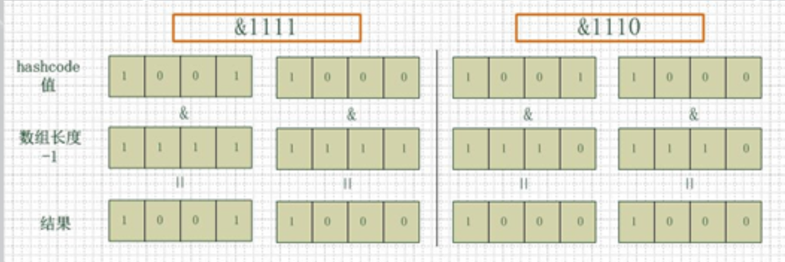

# 概述

* java中集合

# List

## ArrayList

* ArrayList 类是一个可以动态修改的数组，与普通数组的区别就是它是没有固定大小的限制，我们可以添加或删除元素。ArrayList 继承了 AbstractList ，并实现了 List 接口


### 初始化

*  ArrayList底层维护的是一个数组，创建时候可指定数据长度，如果没有指定，将初始化成一个空数组

  ~~~java
  /**
   * Shared empty array instance used for default sized empty instances. We
   * distinguish this from EMPTY_ELEMENTDATA to know how much to inflate when
   * first element is added.
   */
  private static final Object[] DEFAULTCAPACITY_EMPTY_ELEMENTDATA = {};
  /**
   * Constructs an empty list with an initial capacity of ten.
   */
  public ArrayList() {
      this.elementData = DEFAULTCAPACITY_EMPTY_ELEMENTDATA;
  }
  ~~~

  

### 添加元素

* 确保空间可用

    * 数组每次扩容， 新的数据长度 = oldCapacity + (oldCapacity >> 1)，即加上元数组长度的一半向下取整
    
    ~~~java
      private void grow(int minCapacity) {
          // overflow-conscious code
          int oldCapacity = elementData.length;
          int newCapacity = oldCapacity + (oldCapacity >> 1);
          if (newCapacity - minCapacity < 0)
          newCapacity = minCapacity;
          if (newCapacity - MAX_ARRAY_SIZE > 0)
          newCapacity = hugeCapacity(minCapacity);
          // minCapacity is usually close to size, so this is a win:
          elementData = Arrays.copyOf(elementData, newCapacity);
      }
    ~~~

# Map

## HashMap

### 重要属性

* loadFactor： 加载因子

* DEFAULT_LOAD_FACTOR：默认加载因子 0.75

### 重要方法
* 初始化
* put(K key, V value) 
	* 基本流程
		1. 计算key的hashCode值并转换，记为hash，做了一些特殊处理，
        ~~~java
        /**
        * 第一个操作数的的第n位于第二个操作数的第n位相反，那么结果的第n为也为1，否则为0
        * 10111001011100011001001001
        * 00000000000000001011100101
        * 10111001011100010010101100
        */
        (key == null) ? 0 : (h = key.hashCode()) ^ (h >>> 16)
        ~~~
		    
		2. 根据hash值，计算数组下标，判断数组对应位置的值（记为p）是否为null，如果为null，创建新的Node对象，并赋值给数组对应下标上的值，跳过下一步。如果不为null，进行下一步处理
		
		3. 如果p的hash值等于key的hash
* get 

### 问题

1. hashMap的数组长度为什么保持2的次幂

* hashMap的数组长度一定保持2的次幂，比如16的二进制表示为 10000，那么length-1就是15，二进制为01111，同理扩容后的数组长度为32，二进制表示为100000，length-1为31，二进制表示为011111。
  这样会保证低位全为1，而扩容后只有一位差异，也就是多出了最左位的1，这样在通过 h&(length-1)的时候，只要h对应的最左边的那一个差异位为0，就能保证得到的新的数组索引和老数组索引一致(大大减少了之前已经散列良好的老数组的数据位置重新调换)，还有，数组长度保持2的次幂，length-1的低位都为1，会使得获得的数组索引index更加均匀。
  ```java
  static int indexFor(int h, int length) {  
           return h & (length-1);  
  }
  ```
  首先算得key得hashcode值，然后跟数组的长度-1做一次“与”运算（&）。看上去很简单，其实比较有玄机。比如数组的长度是2的4次方，那么hashcode就会和2的4次方-1做“与”运算。很多人都有这个疑问，
  为什么hashmap的数组初始化大小都是2的次方大小时，hashmap的效率最高，我以2的4次方举例，来解释一下为什么数组大小为2的幂时hashmap访问的性能最高。 
  看下图，左边两组是数组长度为16（2的4次方），右边两组是数组长度为15。两组的hashcode均为8和9，但是很明显，当它们和1110“与”的时候，产生了相同的结果，也就是说它们会定位到数组中的同
  一个位置上去，这就产生了碰撞，8和9会被放到同一个链表上，那么查询的时候就需要遍历这个链表，得到8或者9，这样就降低了查询的效率。同时，我们也可以发现，当数组长度为15的时候，hashcode的hashMap的数组长度为什么保持2的次幂
  值会与14（1110）进行“与”，那么最后一位永远是0，而0001，0011，0101，1001，1011，0111，1101这几个位置永远都不能存放元素了，空间浪费相当大，更糟的是这种情况中，数组可以使用的位置比数组
  
  长度小了很多，这意味着进一步增加了碰撞的几率，减慢了查询的效率！
  
  
  
  所以说，当数组长度为2的n次幂的时候，不同的key算得得index相同的几率较小，那么数据在数组上分布就比较均匀，也就是说碰撞的几率小，相对的，查询的时候就不用遍历某个位置上的链表，这样查询效率也就较高了。 
  
  说到这里，我们再回头看一下hashmap中默认的数组大小是多少，查看源代码可以得知是16，为什么是16，而不是15，也不是20呢，看到上面的解释之后我们就清楚了吧，显然是因为16是2的整数次幂的原因，
  
  在小数据量的情况下16比15和20更能减少key之间的碰撞，而加快查询的效率。
