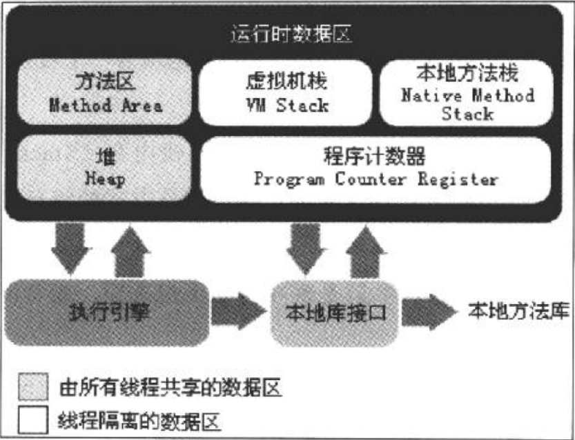
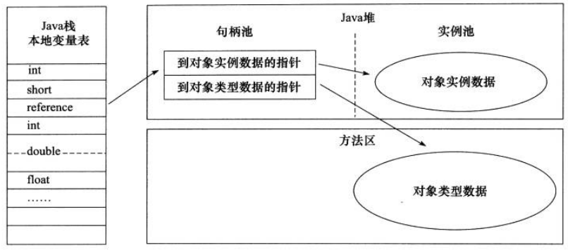

# 1 jave内存区域
## 1.1 运行时数据区域

### 1.1.1 程序计数器
* 程序计数器（Program Counter Register），当前线程所执行的字节码的行号指示器，存放当前线程所执行的字节码的行号，为保证线程的切换、恢复，每条线程都需要有一个独立的程序计数器
* 字节码解析器工作时就是通过改变这个计数器的值来选取下一条需要执行的字节码指令，分支、循环、跳转、异常处理、线程恢复等基础功能都需要依赖这个计数器来完成
* 如果线程正在执行一个java方法，这个计数器记录的就是 正在执行的虚拟机字节码指令的地址，如果正在执行的是一个native方法，这个值则为空（Undefind）
* 是唯一一个在Java虚拟机规范中没有规定任何OutOfMemoryError情况的区域
### 1.1.2 Java虚拟机栈
* Java虚拟机栈(Java Virtual Machine Stacks)，是线程私有的，每个方法在执行的同时都会创建一个栈帧（Stack Frame：方法运行时的基础数据结构），用于存储局部变量表、操作数栈、动态链接、方法出口等信息，每一个方法从调用直至执行完成的过程，就对应着一个栈帧在虚拟机栈中入栈到出栈的过程
* 局部变量表存放了各种基本数据类型、对象引用和ruturnAddress类型（指向了一条字节码指令的地址）
* 局部变量表所需要的内存空间在编译期间完成分配，当进入一个方法时，这个方法需要在帧中分配多大的局部变量空间是完全确定的，在方法运行期间不会改变局部变量表的大小
* 这个区域规定了两种异常情况：
    （1） 线程请求的栈深度如果大于虚拟机栈所允许的深度，将抛出StackOverflowError异常
    （2） 如果虚拟机栈可以扩展。当扩展时无法申请到足够的内存，就会抛出OutOfMemoryError异常
### 1.1.3 本地方法栈
* 为虚拟机使用到的Native方法服务，虚拟机规范中对本地方法区的方法使用的语言、使用方式与数据机构并没有强制规定；
* 本地方法区也会抛出StackOverflowError和OutOfMemoryError异常
### 1.1.4 Java堆
* Java堆是一块被所有线程共享的一块区域，在虚拟机启动时创建，此内存区域的唯一目的就是存放对象实例
* Java堆是垃圾收集器管理的主要区域
* 如果在堆中没有内存完成实例分配，并且堆也无法扩展时，将会抛出OutOfMemoryError异常
### 1.1.5 方法区
* 方法区（Method Area）与Java堆一样，是各个线程的共享区域，它用于存储虚拟机加载的类信息、常量、静态变量、即时编译器编译后的代码等数据
* 根据Java虚拟机规范的约定，当方法区无法满足内存分配需求时，将抛出OutOfMemoryError异常
### 1.1.6 运行时常量池
* 运行时常量池（Runtime Constant Pool）是方法区的一部分，Class文件中除了有类的版本、字段、方法、接口等描述信息外、还有一项信息是常量池（Constant Pool Table），用于存放编译期生成的各种字面量和符号引用，这部分将在类加载后进入方法区的运行时常量池中存放
* 当常量池无法再申请到内存时，将会抛出OutOfMemoryError异常
### 1.1.7 直接内存
* 直接内存（Direct Memory）并不是虚拟机运行时数据区的一部分,也不是Java虚拟机规范中定义的内存区域,但这部分内存也被频繁使用,而且也可能导致OutOfMemoryError异常出现

## 1.2 HotSpot虚拟机对象
### 1.2.1 对象的创建
1. 虚拟机遇到一条new指令时，首先将去检查这个指令的参数能否在常量中定位到一个类的符号引用，并且检查这个符号代表的类是否已被加载、解析和初始化，如果没有，那么就先执行相应的类加载过程
2. 类加载检查通过后，接下来虚拟机将为新生对象分配内存，对象所需内存的大小在类加载完成后便可完全确定，分配方式有：指针碰撞；空闲列表
3. 分配到内存后，虚拟机需要将分配到的内存都初始化为零值（不包含对象头）
4. 接下来，虚拟机需要对对象进行必要的配置，如：对象是哪个类的实例、如何才能吵到傀儡的元数据信息、对象的哈希码、对象的GC分代年龄等信息，这些信息存放在对象的对象头（Object Header）中
### 1.2.2 对象的内存布局
1. 对象头
    1. 用于存储对象自身的运行时数据，如哈希码、GC分代年龄、锁状态标志、线程持有的锁、偏向线程ID、偏向时间戳等
    2. 类型指针：即对象指向它的类元数据的指针，虚拟机通过这个指针来确定这个对象是哪个类的实例
2. 实例数据
    1. 是对象真正存储的有效内容
3. 对齐填充
    1. 不是必然存在的，没有特别的含义，仅仅起着占位符的含义

### 1.2.3 对象的访问定位
* java程序需要通过栈上的reference数据来操作对上的具体对象，目前主流的访问方式有使用句柄和直接指针两种
1. 使用句柄
    * java堆会划分一块区域作为句柄池，reference中存储的就是对象的句柄地址，句柄中包含了对象示例数据与类型数据各自的具体信息
    

2. 使用直接指针
    * java堆对象的布局中就必须考虑如何放置访问类型数据的相关信息
    

## 1.3 OutOfMemoryError(OOM) 异常练习

### 1.3.1 java堆溢出

### 1.3.2 虚拟机栈和本地方法栈溢出

### 1.3.3 方法区和运行时常量池溢出

### 1.3.4 本机直接内存溢出

# 2 垃圾收集器与内存分配策略

## 2.1 对象存活判断

### 2.1.1 引用计数法

### 2.1.2 可达性分析法

### 2.1.3 引用的分类

1. 强引用
    * 指在程序代码中普遍存在的，类似"Object obj = new Object()"这类的引用
2. 软引用
    * 用来描述一些还有用但并非必需的对象
3. 弱引用
    * 用来描述非必需的对象
4. 虚引用
    * 

# 参考连接

[ClassLoader](https://blog.csdn.net/zyzzxycj/article/details/89846181)

