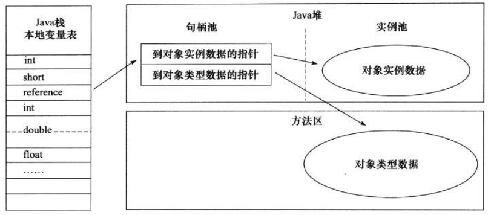

<!-- TOC -->

- 1. jave内存区域
    - 1.1. 运行时数据区域
        - 1.1.1. 程序计数器
        - 1.1.2. Java虚拟机栈
            - 1.1.2.1. 局部变量表
            - 1.1.2.2. 操作数栈
            - 1.1.2.3. 动态链接
            - 1.1.2.4. 方法出口(方法返回地址)
        - 1.1.3. 本地方法栈
        - 1.1.4. Java堆
            - 1.1.4.1. 新生代
            - 1.1.4.2. 老年代
        - 1.1.5. 方法区
        - 1.1.6. 运行时常量池
        - 1.1.7. 直接内存
        - 1.1.8. 方法区的演进
    - 1.2. HotSpot虚拟机对象
        - 1.2.1. 对象的创建
        - 1.2.2. 对象的内存布局
        - 1.2.3. 对象的访问定位
    - 1.3. OutOfMemoryError(OOM) 异常练习
        - 1.3.1. java堆溢出
        - 1.3.2. 虚拟机栈和本地方法栈溢出
        - 1.3.3. 方法区和运行时常量池溢出
        - 1.3.4. 本机直接内存溢出
- 2. 垃圾收集器与内存分配策略
    - 2.1. 对象存活判断
        - 2.1.1. 引用计数法
        - 2.1.2. 可达性分析法
        - 2.1.3. 引用的分类
    - 2.2. 垃圾收集算法
        - 2.2.1. 标记清除算法
        - 2.2.2. 复制算法
        - 2.2.3. 标记整理算法
        - 2.2.4. 分代收集算法
    - 2.3. HotSpot的算法实现
        - 2.3.1. 枚举根节点
        - 2.3.2. 安全点
        - 2.3.3. 安全区域
    - 2.4. 垃圾收集器
        - 2.4.1. Serial收集器
        - 2.4.2. ParNew收集器
        - 2.4.3. Parallel Scavenge收集器
        - 2.4.4. Serial Old收集器
        - 2.4.5. Parallel Old收集器
        - 2.4.6. CMS收集器
        - 2.4.7. G1收集器
        - 2.4.8. GC日志理解
- 3. 参考连接

<!-- /TOC -->

## 1. jave内存区域

### 1.1. 运行时数据区域

#### 1.1.1. 程序计数器
* 程序计数器（Program Counter Reg   ister），当前线程所执行的字节码的行号指示器，存放当前线程所执行的字节码的行号，为保证线程的切换、恢复，每条线程都需要有一个独立的程序计数器
* 字节码解析器工作时就是通过改变这个计数器的值来选取下一条需要执行的字节码指令，分支、循环、跳转、异常处理、线程恢复等基础功能都需要依赖这个计数器来完成
* 如果线程正在执行一个java方法，这个计数器记录的就是 正在执行的虚拟机字节码指令的地址，如果正在执行的是一个native方法，这个值则为空（Undefind）
* 是唯一一个在Java虚拟机规范中没有规定任何OutOfMemoryError情况的区域

#### 1.1.2. Java虚拟机栈
* Java虚拟机栈(Java Virtual Machine Stacks)，是线程私有的，每个方法在执行的同时都会创建一个栈帧（Stack Frame：方法运行时的基础数据结构），用于存储局部变量表、操作数栈、动态链接、方法出口等信息，每一个方法从调用直至执行完成的过程，就对应着一个栈帧在虚拟机栈中入栈到出栈的过程
* 局部变量表存放了各种基本数据类型、对象引用和ruturnAddress类型（指向了一条字节码指令的地址）
* 局部变量表所需要的内存空间在编译期间完成分配，当进入一个方法时，这个方法需要在帧中分配多大的局部变量空间是完全确定的，在方法运行期间不会改变局部变量表的大小
* 这个区域规定了两种异常情况：
    （1） 线程请求的栈深度如果大于虚拟机栈所允许的深度，将抛出StackOverflowError异常
    （2） 如果虚拟机栈可以扩展。当扩展时无法申请到足够的内存，就会抛出OutOfMemoryError异常

##### 1.1.2.1. 局部变量表

局部变量表是一组变量值存储空间，用于存放方法参数和方法内部定义的局部变量，其中存放的数据的类型是编译期可知的各种基本数据类型、对象引用（reference）和returnAddress类型（它指向了一条字节码指令的地址）。基本数据类型，则存在局部变量表中，引用类型。如String，局部变量表中存的是引用，而实例在堆中。局部变量表所需的内存空间在编译期间完成分配，即在Java程序被编译成Class文件时，就确定了所需分配的最大局部变量表的容量。当进入一个方法时，这个方法需要在栈中分配多大的局部变量空间是完全确定的，在方法运行期间不会改变局部变量表的大小

> 拓展：
局部变量表的容量以变量槽（Slot）为最小单位。在虚拟机规范中并没有明确指明一个Slot应占用的内存空间大小（允许其随着处理器、操作系统或虚拟机的不同而发生变化），一个Slot可以存放一个32位以内的数据类型：boolean、byte、char、short、int、float、reference和returnAddresss。reference是对象的引用类型，returnAddress是为字节指令服务的，它执行了一条字节码指令的地址。对于64位的数据类型（long和double），虚拟机会以高位在前的方式为其分配两个连续的Slot空间。
虚拟机通过索引定位的方式使用局部变量表，索引值的范围是从0开始到局部变量表最大的Slot数量，对于32位数据类型的变量，索引n代表第n个Slot，对于64位的，索引n代表第n和第n+1两个Slot。
在方法执行时，虚拟机是使用局部变量表来完成参数值到参数变量列表的传递过程的，如果是实例方法（非static），则局部变量表中的第0位索引的Slot默认是用于传递方法所属对象实例的引用，在方法中可以通过关键字“this”来访问这个隐含的参数。其余参数则按照参数表的顺序来排列，占用从1开始的局部变量Slot，参数表分配完毕后，再根据方法体内部定义的变量顺序和作用域分配其余的Slot。
局部变量表中的Slot是可重用的，方法体中定义的变量，作用域并不一定会覆盖整个方法体，如果当前字节码PC计数器的值已经超过了某个变量的作用域，那么这个变量对应的Slot就可以交给其他变量使用。这样的设计不仅仅是为了节省空间，在某些情况下Slot的复用会直接影响到系统的而垃圾收集行为。

##### 1.1.2.2. 操作数栈

操作数栈又常被称为操作栈，操作数栈的最大深度也是在编译的时候就确定了。32位数据类型所占的栈容量为1, 64位数据类型所占的栈容量为2。

当一个方法开始执行时，它的操作栈是空的，在方法的执行过程中，会有各种字节码指令（比如：加操作、赋值元算等）向操作栈中写入和提取内容，也就是入栈和出栈操作。

Java虚拟机的解释执行引擎称为“基于栈的执行引擎”，其中所指的“栈”就是操作数栈。因此我们也称Java虚拟机是基于栈的，这点不同于Android虚拟机，Android虚拟机是基于寄存器的。

基于栈的指令集最主要的优点是可移植性强，主要的缺点是执行速度相对会慢些；
由于寄存器由硬件直接提供，所以基于寄存器指令集最主要的优点是执行速度快，主要的缺点是可移植性差。
接着解释一下操作数栈，还是比较容易理解的。假如Test.java中有如下方法，
~~~java
public int getSum(int a, int b) {
    return a + b;
}
~~~

反编译生成的Test.class文件，并输出到show.txt中
~~~
javap -v Test.class > show.txt
~~~
show.txt的内容如下，简单2个数相加都会用到栈，这个栈就是操作数栈。
~~~
public int getSum(int, int);
  descriptor: (II)I
  flags: ACC_PUBLIC
  Code:
    stack=2, locals=3, args_size=3
       0: iload_1 # 局部变量1压栈
       1: iload_2 # 局部变量2压栈
       2: iadd    # 栈顶2个元素相加，计算结果压栈
       3: ireturn
    LineNumberTable:
      line 12: 0
~~~

##### 1.1.2.3. 动态链接

每个栈帧都包含一个指向运行时常量池（在方法区中，后面介绍）中该栈帧所属方法的引用，持有这个引用是为了支持方法调用过程中的动态连接。Class文件的常量池中存在有大量的符号引用，字节码中的方法调用指令就以常量池中指向方法的符号引用为参数。这些符号引用，一部分会在类加载阶段或第一次使用的时候转化为直接引用（如final、static域等），称为静态解析，另一部分将在每一次的运行期间转化为直接引用，这部分称为动态连接。

##### 1.1.2.4. 方法出口(方法返回地址)

当一个方法被执行后，有两种方式退出该方法：执行引擎遇到了任意一个方法返回的字节码指令或遇到了异常，并且该异常没有在方法体内得到处理。无论采用何种退出方式，在方法退出之后，都需要返回到方法被调用的位置，程序才能继续执行。方法返回时可能需要在栈帧中保存一些信息，用来帮助恢复它的上层方法的执行状态。一般来说，方法正常退出时，调用者的PC计数器的值就可以作为返回地址，栈帧中很可能保存了这个计数器值，而方法异常退出时，返回地址是要通过异常处理器来确定的，栈帧中一般不会保存这部分信息。

方法退出的过程实际上等同于把当前栈帧出站，因此退出时可能执行的操作有：恢复上层方法的局部变量表和操作数栈，如果有返回值，则把它压入调用者栈帧的操作数栈中，调整PC计数器的值以指向方法调用指令后面的一条指令。

#### 1.1.3. 本地方法栈
* 为虚拟机使用到的Native方法服务，虚拟机规范中对本地方法区的方法使用的语言、使用方式与数据机构并没有强制规定；
* 本地方法区也会抛出StackOverflowError和OutOfMemoryError异常

#### 1.1.4. Java堆
* Java堆是一块被所有线程共享的一块区域，在虚拟机启动时创建，此内存区域的唯一目的就是存放对象实例
* 如果在堆中没有内存完成实例分配，并且堆也无法扩展时，将会抛出OutOfMemoryError异常
* Java堆是垃圾收集器管理的主要区域，而现代VM采用分代收集算法，因此java堆从GC角度分为新生代（MinorGC）和老年代（MajorGC）

1. 新生代
   1. Eden区
   2. From Survivor(/səˈvaɪvə(r)/)
   3. To Survivor
2. 老年代 

> jdk1.8以后：新生代（Eden区、From Suivivor、To Survivor）、元空间（可以理解为直接物理内存）
> jdk1.8以前：新生代（Eden区、From Suivivor、To Survivor）、老年代、永久代

##### 1.1.4.1. 新生代
用于存放新生对象、占用堆1/3的空间、由于平凡创建对象，所以新生代会频繁出发MinorGC进行垃圾回收

###### 1.4.1.1. Eden区

java新对象的出生地（如果对象占用内存很大，则直接分配到老年代），当Eden区内存不足时将会触发MinorGC

###### 1.4.1.2. From Survivor

存放上一次MinorGC的幸存者，作为下一次MinorGC的扫描者

###### 1.4.1.3. To Survivor

保存一次MinorGC过程中的幸存者

###### 1.4.1.4. MinorGC的过程

    MinorGC采用复制算法，主要过程：复制->清空->互换
1. 复制：eden区、From Servivor区内的对象复制到To Servivor区(如果对象年龄已经达到了老年代的标准、则赋值到老年代)，同时年龄+1（如果To Servivor区内存不足，则放到老年代）
2. 清空：清空eden区、From Servivor区内的所有对象
3. From Servivor区和To Servivor区进行互换，原To Servivor区作为下一次MinorGC的From Servivor区

##### 1.1.4.2. 老年代
存放应用程序中生命周期长的对象,老年代存放的对象相对较为稳定，所以MajorGC不会频繁执行，在进行MajorGC前一般都会先执行一次MinorGC使得新生代内达到回收条件的对象都晋升到老年代，导致空间不足时候才会触发，当无法找到足够大连续空间分配给新创建的较大对象时候也会提前触发一次MajorGC

###### 1.4.2.1. MajorGC的过程

MajorGC采用 **标记清除算法**，首先扫描一次所有老年代，标记出存活对象，然后回收没有标记的对象。MajorGC耗时较长。

#### 1.1.5. 方法区
* 方法区（Method Area）与Java堆一样，是各个线程的共享区域，它用于存储虚拟机加载的类信息、常量、静态变量、即时编译器编译后的代码等数据
* 根据Java虚拟机规范的约定，当方法区无法满足内存分配需求时，将抛出OutOfMemoryError异常

#### 1.1.6. 运行时常量池
* 运行时常量池（Runtime Constant Pool）是方法区的一部分，Class文件中除了有类的版本、字段、方法、接口等描述信息外、还有一项信息是常量池（Constant Pool Table），用于存放编译期生成的各种字面量和符号引用，这部分将在类加载后进入方法区的运行时常量池中存放
* 当常量池无法再申请到内存时，将会抛出OutOfMemoryError异常

#### 1.1.7. 直接内存
* 直接内存（Direct Memory）并不是虚拟机运行时数据区的一部分,也不是Java虚拟机规范中定义的内存区域,但这部分内存也被频繁使用,而且也可能导致OutOfMemoryError异常出现

#### 1.1.8. 方法区的演进

* jdk1.6及之前：有永久代（permanent generation） ，静态变量存放在 永久代上。
* jdk1.7：有永久代，但已经逐步“去永久代”，字符串常量池、静态变量移除，保存在堆中。
* java8及之后： 无永久代，类型信息、字段、方法、常量保存在本地内存的元空间，但字符串常量池、静态变量仍留在堆空间。
 
 java8中，永久代已经别删除了，取而代之的是一个成为“元数据区”(又称为“元空间”)的区域，元数据区本质和永久代类似，元数据区与永久代之间的区别在于，元数据区并不在虚拟机中，而是使用本地内存，因此，元数据区的大小仅受本地内存的限制。这项改动是很有必要的，主要原因有：
 1. 为永久代设置空间大小是很难确定的。 在某些场景下，如果动态加载类过多，容易产生Perm区（永久代）的O0M。比如某个实际Web工程中，因为功能点比较多，在运行过程中，要不断动态加载很多类，经常出现致命错误。 “Exception in thread’ dubbo client x.x connector’java.lang.OutOfMemoryError：PermGenspace” 而元空间和永久代之间最大的区别在于：元空间并不在虚拟机中，而是使用本地内存。因此，默认情况下，元空间的大小仅受本地内存限制。
 2. 对永久代进行调优是很困难的

### 1.2. HotSpot虚拟机对象

#### 1.2.1. 对象的创建
1. 虚拟机遇到一条new指令时，首先将去检查这个指令的参数能否在常量中定位到一个类的符号引用，并且检查这个符号代表的类是否已被加载、解析和初始化，如果没有，那么就先执行相应的类加载过程
2. 类加载检查通过后，接下来虚拟机将为新生对象分配内存，对象所需内存的大小在类加载完成后便可完全确定，分配方式有：指针碰撞；空闲列表
3. 分配到内存后，虚拟机需要将分配到的内存都初始化为零值（不包含对象头）
4. 接下来，虚拟机需要对对象进行必要的配置，如：对象是哪个类的实例、如何才能找到类的元数据信息、对象的哈希码、对象的GC分代年龄等信息，这些信息存放在对象的对象头（Object Header）中

#### 1.2.2. 对象的内存布局
1. 对象头
    1. 用于存储对象自身的运行时数据，如哈希码、GC分代年龄、锁状态标志、线程持有的锁、偏向线程ID、偏向时间戳等
    2. 类型指针：即对象指向它的类元数据的指针，虚拟机通过这个指针来确定这个对象是哪个类的实例
2. 实例数据
    1. 是对象真正存储的有效内容
3. 对齐填充
    1. 不是必然存在的，没有特别的含义，仅仅起着占位符的含义

#### 1.2.3. 对象的访问定位
* java程序需要通过栈上的reference数据来操作对上的具体对象，目前主流的访问方式有使用句柄和直接指针两种
1. 使用句柄
    * java堆会划分一块区域作为句柄池，reference中存储的就是对象的句柄地址，句柄中包含了对象示例数据与类型数据各自的具体信息
    

2. 使用直接指针
    * java堆对象的布局中就必须考虑如何放置访问类型数据的相关信息
    

### 1.3. OutOfMemoryError(OOM) 异常练习

#### 1.3.1. java堆溢出

#### 1.3.2. 虚拟机栈和本地方法栈溢出

#### 1.3.3. 方法区和运行时常量池溢出

#### 1.3.4. 本机直接内存溢出

## 2. 垃圾收集器与内存分配策略

### 2.1. 对象存活判断

#### 2.1.1. 引用计数法

#### 2.1.2. 可达性分析法

#### 2.1.3. 引用的分类

1. 强引用
    * 指在程序代码中普遍存在的，类似"Object obj = new Object()"这类的引用
2. 软引用
    * 用来描述一些还有用但并非必需的对象，该类引用关联着的对象，在系统将要发生内存溢出异常之前，将会把这些对象列进回收范围之中进行二次回收，如果这次回收还没有足够的内存，才会抛出内存溢出异常，在jdk1.2之后，提供了SoftReference类来实现软引用
3. 弱引用
    * 用来描述非必需的对象，被弱引用关联的对象只能存活到下一次垃圾收集发生之前，当垃圾收集器工作时，无论当前内存是否足够，都会回收被弱引用关联的对象，在jdk1.2以后，提供了WeakReference类来实现弱引用
4. 虚引用
    * 也称为幽灵引用或幻影引用，一个对象是否有虚引用的存在，完全不会对其生存时间构成影响，也无法通过虚引用来取得一个对象实例，为一个对象设置虚引用的唯一目的就是能在这个对象被回收的时候收到一个系统通知，以达到跟踪对象被垃圾回收的状态，jdk1.2以后提供了PhantomReference类来实现虚引用。

### 2.2. 垃圾收集算法

#### 2.2.1. 标记清除算法

#### 2.2.2. 复制算法

#### 2.2.3. 标记整理算法

#### 2.2.4. 分代收集算法

### 2.3. HotSpot的算法实现

#### 2.3.1. 枚举根节点

#### 2.3.2. 安全点

#### 2.3.3. 安全区域

### 2.4. 垃圾收集器

#### 2.4.1. Serial收集器

#### 2.4.2. ParNew收集器

#### 2.4.3. Parallel Scavenge收集器

#### 2.4.4. Serial Old收集器

#### 2.4.5. Parallel Old收集器

#### 2.4.6. CMS收集器

#### 2.4.7. G1收集器

#### 2.4.8. GC日志理解

## 3. 参考连接

[ClassLoader](https://blog.csdn.net/zyzzxycj/article/details/89846181)
[从一道面试题开始学习JVM](https://zhuanlan.zhihu.com/p/408356798?utm_id=0)

