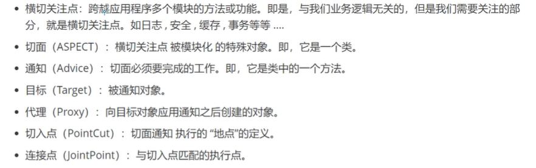

# spring
## Bean
* spring对bean的使用，主要有两种方式，一种是xml配置文件的配置，一种是通过注解的方式实现
## IOC 控制反转（IoC:Inversion of Control）
* 含义：控制权的转移，应用程序本身不负责依赖对象的创建和维护，而是由外部容器负责创建和维护
* DI(依赖注入): 是IOC的一种实现方式
* 目的：创建对象并且组装对象之间的关系
* 反转：获取依赖对象的过程被反转了
## Spring注入方式
* 设值注入；
* 构造注入；
* 接口注入；

## bean
### bean的常用配置项
* id : bean在IOC容器中的唯一标识
* class : 具体要实例化的类名
* scope : 是bean的作用域
* Constructor arguments ：构造器参数
* Properties : bean的属性
* AutoWiring mode : 自动装配模式
* init-method : bean初始化时执行的方法
* lazy-initialization mode : 懒加载模式
* Initialization/destryction method : 初始化和销毁的方法
> 理论上讲bean的配置中只有class是必须的，想从IOC容器中获取bean的实例，有两种方式一个是通过id获取，这时候就需要配置bean的id，另一种方式就是通过类获取，这时候只需要配置bean的class就足够了
### bean的作用域
* singleton : （默认作用域）单例，指一个bean容器中只存在一份
* prototype : 每次请求（每次使用）都会创建新的实例
* request ： 每次http请求创建一个实例且仅在当前request内有效
* session ： 同上，每次http请求创建，当前session内有效
* global session ： 基于protlet的web中有效（portlet定义的global session），如果是在web中，同session
### bean的生命周期
#### 定义 
* 定义 ：及在配置文件中配置bean的属性及参数
#### 初始化
* 实现org.springframework.beans.factory.InitializingBean接口，覆盖afterPropertiesSet方法
~~~java
    public class OneInterfaceImpl implements InitializingBean {
        @Override
        public void afterPropertiesSet() throws Exception {
            System.out.println("--- 实现InitializingBean接口，重写afterPropertiesSet方法 ---");
        }
    }
~~~
* 配置init-method属性
~~~xml
    <bean id="oneInterface"
          class="com.test.ioc.interfaceImpls.OneInterfaceImpl"
          init-method="init"
    ></bean>
~~~
~~~java
    public void init(){
        System.out.println("--- 配置init-method = 'init' ---");
    }
~~~
> 如果两种方式同时使用，第一种方式优先执行
#### 使用 
* 使用 ：及通过context得到对象的实例
#### 销毁
* 实现org.springframework.beans.factory.InitializingBean接口，覆盖afterPropertiesSet方法
~~~java
    public class OneInterfaceImpl implements DisposableBean {
        @Override
        public void destroy() throws Exception {
            System.out.println("--- 实现DisposableBean接口，重写destroy方法 ---");
        }
    }
~~~
* 配置init-method属性
~~~xml
    <bean id="oneInterface"
          class="com.test.ioc.interfaceImpls.OneInterfaceImpl"
          destroy-method="destroyMethod"
    ></bean>
~~~
~~~java
    public void destroyMethod(){
        System.out.println("--- destroy-method=\"destroyMethod\" ---");
    }
~~~
> 如果两种方式同时使用，第一种方式优先执行
#### 配置全局的初始化和销毁的方法
~~~xml
<beans xmlns="http://www.springframework.org/schema/beans"
       xmlns:xsi="http://www.w3.org/2001/XMLSchema-instance"
       xsi:schemaLocation="http://www.springframework.org/schema/beans http://www.springframework.org/schema/beans/spring-beans.xsd"
       default-init-method="defInitMethod"
       default-destroy-method="defDestroyMethod"
>
<!-- 当定义一个bean时如果设置了init-method或destroy-method属性时，将不再实行默认的始化或销毁的方法，而执行bean中init-method或destroy-method属性对应的始化或销毁方法 -->
<beans>
~~~
### Aware接口
* spring中提供了一些以Aware结尾的接口，实现了Aware接口的bean在被初始化之后，可以获取相应的资源
* 通过Aware接口可以对Spring相应的资源进行操作（慎用）
* 为对Spring进行简单的扩展提供的方便的接口
### Bean的自动装配（Autowiring）
#### 自动装配的几种类型
1. No : 不做任何操作
2. byname : 根据属性名自动装配，此选项将检查容器并根据名字查找与属性完全一致的bean，并将其与属性自动装配，使用byName的时候，必须有set方法
3. byType : 如果一个容器中存在一个与指定属性类型相同的bean，那么将域该属性自动装配；如果存在多个该类型的bean，那么将抛出异常，并不能使用byType方式进行自动装配；如果没有找到相匹配的bean，则什么也不发生，使用byType的时候，必须有set方法
4. Constructor : 与byType类似，不同之处在于它应用于构造器参数。如果容器中没有找到与构造器参数一致的bean，那么抛出异常
#### Spring Bean装配之Resources
* 针对资源文件的统一接口
* Resources
1. UrlResource:URL对应的资源，根据一个URL地址即可创建
2. ClassPathResource:获取类路径下的资源文件
3. FileSystemResource:获取文件系统里的资源
4. ServletContextResource:ServletContext封装的资源，用于访问ServletContext环境下的资源
5. InputStreamResource:针对于输入流封装的资源
6. ByteArrayResource:针对字节数组封装的资源

## Spring Bean装配之Bean的定义及作用域的注解实现
### Classpath 扫描与组件管理
1. 从Spring3.0 开始，Spring JavaConfig项目提供了很多特性，包括使用java而不是XML定义bean,比如@Configuration ,@Bean,@Import,@DependsOn,
2. @Component是一个通用注解，可用于任何Bean，
3. @Repository ,@Service,@Controller 是更有针对性的注解
4. @Repository:通常用于注解Dao类，即持久层
5. @Service:通常用于注解Service类，即服务层
6. @Controller:通常用于Controllor类，即控制层（MVC）
### 元注解（Meta-annotations）
* 许多Spring提供的注解可以作为字节的代码，即“元数据注解”，元注解是一个简单的注解，可以应用到另一个注解
* 除了value(),元注解还可以有其他属性，允许定制
### 类的自动检测及Bean的注册
* spring 可以自动检测类并注册Bean到ApplicationContext中
* 为了能够检测到这些类并注册相应的Bean，需要下面内容
~~~xml
<beans xmlns="http://www.springframework.org/schema/beans"
       xmlns:xsi="http://www.w3.org/2001/XMLSchema-instance"
       xmlns:context="http://www.springframework.org/schema/context"
       xsi:schemaLocation="http://www.springframework.org/schema/beans
            http://www.springframework.org/schema/beans/spring-beans.xsd
            http://www.springframework.org/schema/context
            http://www.springframework.org/schema/context/spring-context.xsd"
>
    <context:component-scan base-package="com.ltkj.beanannotation"></context:component-scan>
</beans>
~~~
* <context:component-scan> 包 <context:annotation-config>,通常在使用前者后不再使用后者，AutowiredAnnotationBeanPostProcessor和CommonAnnotationBeanPostProcessor也被包含进来

# 循环依赖问题
 
1. 三级缓存中分别保存的是什么对象
   * 一级：成品对象
   * 二级：半成品对象
   * 三级：lambda表达式
2. 如果只使用一级缓存行不行
   不行，因为成品和半成品对象会存放到一起，在进行对象获取的时候有可能获取到的半成品对象，这样的对象没办法使用的
3. 如果只使用二级缓存行不行
   getSingleton
   doCreateBean
   只有二级缓存的时候也可以解决循环依赖的问题
   添加aop的实现之后，会报错，This means that said other beans do not use the final version of the bean没有使用最终版本的bean对象
4. 三级缓存存在到底做了什么事情
   如果一个对象需要被代理，生成代理对象，那么这个对象需要预先生成代理对象
   三级缓存到底做了什么：
   lambda.getEarlyBeanReference()，只要搞清楚这个方法的具体执行逻辑即可
   在当前方法中，有可能会用代理对象替换非代理对象，如果没有三级缓存的话，那么就无法得到代理对象，换句话说，在整个容器中，包含了同名对象的代理对象和非代理对象，这样是不可以的，容器中对象都是单例的，以为着根据名称只能获取一个对象的值，此时同时存在两个对象的话，使用的时候应该取哪一个？无法判断，
   谁也无法确认什么时候会调用当前对象，是在其他对象的执行构成中来进行调用的，而不是任务判定的，所以必须要保证容器中任何时候都只有一个对象提供外部使用，所以在三级缓存中，完成了一件代理对象替换非代理对象的工作，确定返回的是唯一的对象
   三级缓存是为了解决在AOP代理过程中产生的循环依赖问题，如果没有AOP的话，二级缓存足以解决循环依赖问题
   其实相当于是一个回调机智，当需要使用当前对象是，会判断此对象是否需要被代理实现，如果需要直接替换，不需要直接返回非代理对象即可

# AOP

* **横切关注点**：跨越应用程序多个模块的方法或功能，即是，与我们业务逻辑无关的，但是我们需要关注的部分，就是横切关注点，如日志，安全，缓存，事务等等
* **切面（ASPECT）**：横切关注点呗模块化的特殊对象，它是一个类
* **通知（Advice）**：切面必须要完成的工作，它是类中的一个方法
* **目标（Target）**：被通知的对象
* **代理（Proxy）**：向目标对象应用通知后创建的对象
* **切入点（PointCut）**：切面通知指向的“地点”的定义
* **连接点（JointCut）**：与切入点匹配的执行点

# getBean
* AbstractBeanFactory.getBean
* AbstractBeanFactory.doGetBean

