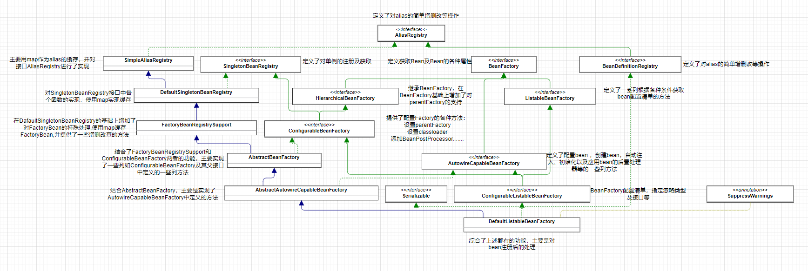

#  Spring源码深度解析

## 容器的基本实现

### 容器的基本用法

1. 定义bean
~~~java
    public class MyTest{
        private String  str = "test";

        public String getStr(){
            return str;
        }

        public String setStr(String str){
            this.str = str
        }
    }
~~~
2. 配置xml文件
~~~xml
<?xml version="1.0" encoding="UTF-8"?>
<beans xmlns="http://www.springframework.org/schema/beans"
       xmlns:xsi="http://www.w3.org/2001/XMLSchema-instance"
       xsi:schemaLocation="http://www.springframework.org/schema/beans http://www.springframework.org/schema/beans/spring-beans.xsd">

    <bean id="myTest" class="com.test.bean.MyTest"/>

</beans>
~~~
3. 使用容器

~~~java
public class BeanFactoryTest{

    public static void main(String[] args){
        BeanFactory bf = new XmlBeanFactory(new new ClassPathResource("beanFactoryTest.xml"));
        MyTest bean = (MyTest) bf.getBean("myTest");
        bean.getStr();
    }

}
~~~

### Spring的结构组成

#### 核心类分析

1. DefaultListableBeanFactory

DefaultListableBeanFactory是整个bean加载的核心部分，是Spring注册及加载bean的默认实现，

2. XmlBeanDefinitionReader

