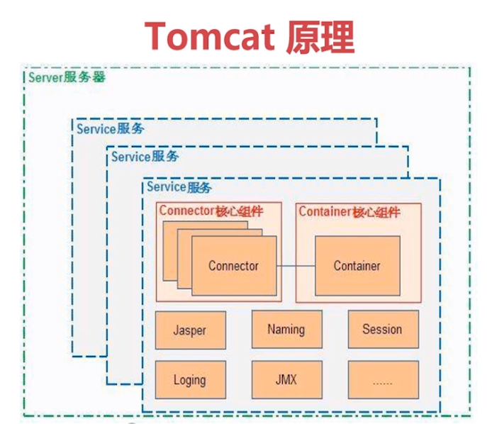
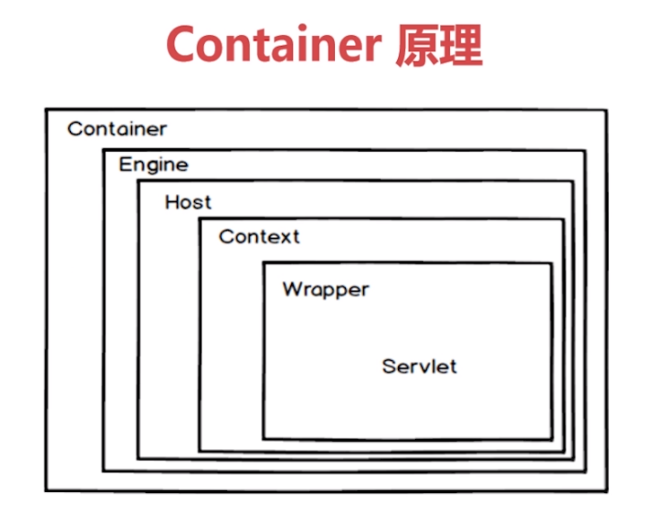
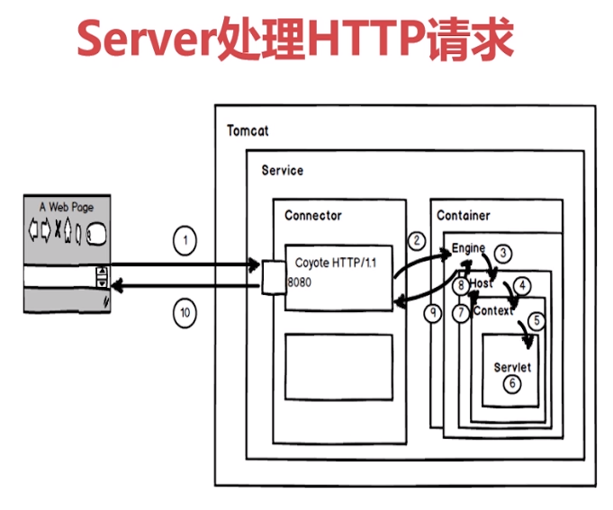

# tomcat
## tomcat原理

### server服务器
1. 指整个tomcat服务器，包含多个组件，负责管理和启动各个service，同时还要监听8005端口发来的shutdown命令，用于关闭整个服务器
### service服务
1. 是整个tomcat封装的，主要对外提供基于组件的web服务，包含connector和container两个核心组件，以及多个功能组件
2. 各个service之间是相互独立的，当同时共享一个虚拟机资源
### connector核心组件
1. 是tomcat与外部世界的连接器，监听固定的端口，接收外部请求，将请求传递给container，并且将container的处理结果返回给外部
### container核心组件
1. container是一个servelt容器，内部由多层容器组成，主要用于管理servelt的生命周期，调用servlet的相关方法去处理业务逻辑
### jasper
1. tomcat的jsp解析引擎，用与将jsp文件解析为java文件，并且编译成.class文件
### Naming
1. 是一个命名服务，主要讲名称和对象联系起来，使我们可以用名称去访问对象
### session
1. 负责创建和管理session，以及session的持久化，是可以自定义的，支持session的集群
2. 对于tomcat而言，session是在服务器开辟的内存空间，开发中常用session存储一些临时信息
### logging
1. 负责记录相关日志，包含相关访问错误信息，运行信息等等
### JMX
1. javaSE中定义的一个技术规范，只要是一个为应用程序、设备、系统等植入管理功能的一个框架，通过JMX可以远程监控tomcat的运行状态
## Connector组件
### 主要功能
1. 接收客户端连接
2. 加工处理客户端请求
### 说明
1. 每个connector都对一个端口进行监听，分别负责去请求报文的解析和响应报文的组装，解析的过程就会生成request对象，柱状的过程就涉及response对象
2. connector就相当于一个链接器，为外部链接tomcat提供了通道
## Container组件
### 描述
1. 是所有的子容器的父接口：所有的子容器都必须实现这个接口
2. 责任链设计模式：在tomcat中，container容器的设计是典型的责任链设计模式
3. 主要有四个子容器：Engine,Host,Context,Wrapper
### Container原理

1. 上图体现了个容器间的父子关系
2. Engine：用于管理多个站点，但一个service只能有一个Engine
3. Host：代表一个站点，也可以将虚拟主机通过配置Host就可以添加站点  
4. Context：代表一个应用程序，相当于平时开发程序中的war包
5. Wrapper：理解成一个封装了的servlet
## server处理HTTP请求的过程

