# Docker介绍

## 学习内容

### 主要路线

* Docker概述
* Docker安装
* Docker命令
* Docker镜像
* 容器数据卷
* DockerFile
* Docker网络原理
* IDEA整合Docker
* Docker Compose
* Docker Swarm
* CI\CD jenkins

### 必备网站
1. Docker官网：https://www.docker.com/get-started/
2. 官网文档：https://docs.docker.com/
3. DockerHub： https://hub.docker.com/

## Docker概述

### 什么是Docker
* 百度百科：Docker 是一个开源的应用容器引擎，让开发者可以打包他们的应用以及依赖包到一个可移植的镜像中，然后发布到任何流行的 Linux或Windows操作系统的机器上，也可以实现虚拟化。容器是完全使用沙箱机制，相互之间不会有任何接口。

Docker 是一个开源的应用容器引擎，基于 Go 语言 并遵从 Apache2.0 协议开源。

Docker 可以让开发者打包他们的应用以及依赖包到一个轻量级、可移植的容器中，然后发布到任何流行的 Linux 机器上，也可以实现虚拟化。

容器是完全使用沙箱机制，相互之间不会有任何接口（类似 iPhone 的 app）,更重要的是容器性能开销极低

Docker 在容器的基础上，进行了进一步的封装，从文件系统、网络互联到进程隔离等等，极大的简化了容器的创建和维护。使得 Docker 技术比虚拟机技术更为轻便、快捷

### Docker的应用场景
1. Web 应用的自动化打包和发布。
2. 自动化测试和持续集成、发布。
3. 在服务型环境中部署和调整数据库或其他的后台应用。
4. 从头编译或者扩展现有的 OpenShift 或 Cloud Foundry 平台来搭建自己的 PaaS 环境。

### Docker与传统虚拟化方式的不同
    Docker 和传统虚拟化方式的不同之处。传统虚拟机技术是虚拟出一套硬件
后，在其上运行一个完整操作系统，在该系统上再运行所需应用进程；而容器内的应用进程直接运行于宿主的内核，容器内没有自己的内核，而且也没有进行硬件虚拟。因此容器要比传统虚拟机更为轻便
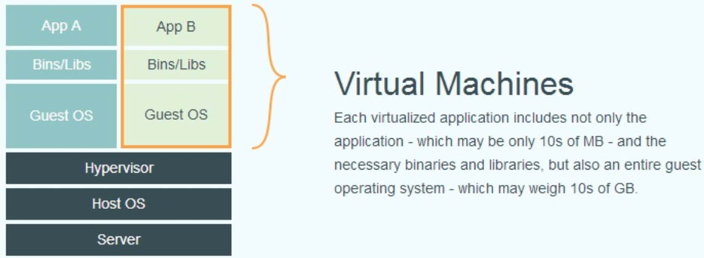
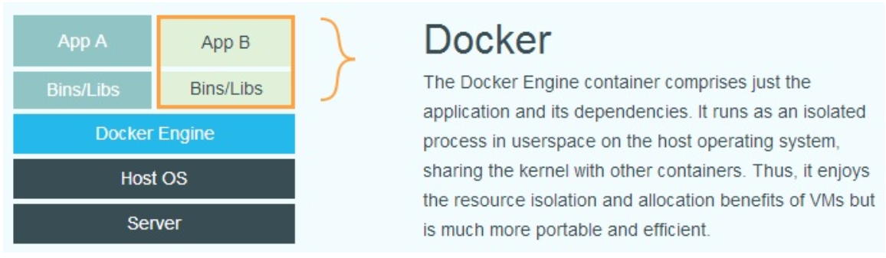
所以说，新建一个容器的时候，docker不需要像虚拟机一样重新加载一个操作系统内核，避免引导操作，虚拟机是加载GuesrOS,是分钟级别的操作，Docker是利用宿主机的操作系统的，省略了这个复杂的过程，是一个秒级的操作

### Docker 的优点

Docker 是一个用于开发，交付和运行应用程序的开放平台。Docker 使您能够将应用程序与基础架构分开，从而可以快速交付软件。借助 Docker，您可以与管理应用程序相同的方式来管理基础架构。通过利用 Docker 的方法来快速交付，测试和部署代码，您可以大大减少编写代码和在生产环境中运行代码之间的延迟。

1. 快速，一致地交付您的应用程序

Docker 允许开发人员使用您提供的应用程序或服务的本地容器在标准化环境中工作，从而简化了开发的生命周期。

容器非常适合持续集成和持续交付（CI / CD）工作流程，请考虑以下示例方案：

* 您的开发人员在本地编写代码，并使用 Docker 容器与同事共享他们的工作。
* 他们使用 Docker 将其应用程序推送到测试环境中，并执行自动或手动测试。
* 当开发人员发现错误时，他们可以在开发环境中对其进行修复，然后将其重新部署到测试环境中，以进行测试和验证。
* 测试完成后，将修补程序推送给生产环境，就像将更新的镜像推送到生产环境一样简单。

2. 响应式部署和扩展

Docker 是基于容器的平台，允许高度可移植的工作负载。Docker 容器可以在开发人员的本机上，数据中心的物理或虚拟机上，云服务上或混合环境中运行。

Docker 的可移植性和轻量级的特性，还可以使您轻松地完成动态管理的工作负担，并根据业务需求指示，实时扩展或拆除应用程序和服务。

3. 在同一硬件上运行更多工作负载

Docker 轻巧快速。它为基于虚拟机管理程序的虚拟机提供了可行、经济、高效的替代方案，因此您可以利用更多的计算能力来实现业务目标。Docker 非常适合于高密度环境以及中小型部署，而您可以用更少的资源做更多的事情。

4. 对比传统虚拟机总结

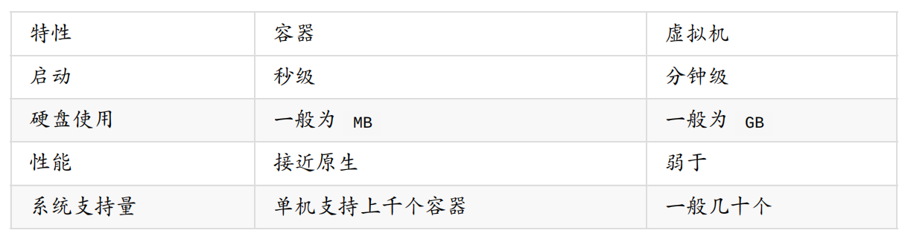

# Docker安装

## Docker基本组成

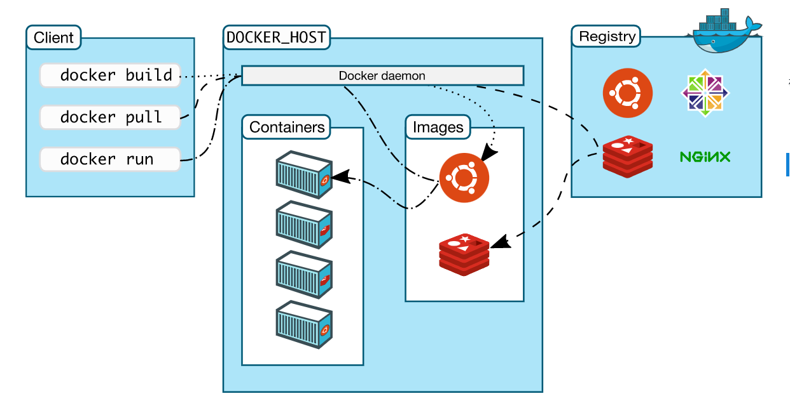

## 常见名词概念

1. 镜像（Image）
   
   Docker 镜像（Image），就相当于是一个 root 文件系统。比如官方镜像 ubuntu:16.04 就包含了完整的一套 Ubuntu16.04 最小系统的 root 文件系统

2. 容器（Container）

   镜像（Image）和容器（Container）的关系，就像是面向对象程序设计中的类和实例一样，镜像是静态的定义，容器是镜像运行时的实体。容器可以被创建、启动、停止、删除、暂停等

3. 仓库（Repository）
   
   仓库可看成一个代码控制中心，用来保存镜像

## 安装Docker

### 安装准备
1. CentOS 7
2. 系统内核

~~~shell
# 系统内核是3.10以上的
[root@CENTOS-DOCKER ~]# uname -r
3.10.0-693.el7.x86_64
# 系统版本
[root@CENTOS-DOCKER ~]# cat /etc/os-release
NAME="CentOS Linux"
VERSION="7 (Core)"
ID="centos"
ID_LIKE="rhel fedora"
VERSION_ID="7"
PRETTY_NAME="CentOS Linux 7 (Core)"
ANSI_COLOR="0;31"
CPE_NAME="cpe:/o:centos:centos:7"
HOME_URL="https://www.centos.org/"
BUG_REPORT_URL="https://bugs.centos.org/"

CENTOS_MANTISBT_PROJECT="CentOS-7"
CENTOS_MANTISBT_PROJECT_VERSION="7"
REDHAT_SUPPORT_PRODUCT="centos"
REDHAT_SUPPORT_PRODUCT_VERSION="7"
~~~

### 安装

    参考帮助官方文档：https://docs.docker.com/engine/install/centos/

~~~shell

# 1、卸载旧版本

sudo yum remove docker \
                  docker-client \
                  docker-client-latest \
                  docker-common \
                  docker-latest \
                  docker-latest-logrotate \
                  docker-logrotate \
                  docker-engine
# 2、需要的安装包
sudo yum install -y yum-utils

# 3. 设置镜像的仓库
sudo yum-config-manager \
    --add-repo \
    https://download.docker.com/linux/centos/docker-ce.repo #镜像仓库默认是国外的

sudo yum-config-manager \
    --add-repo \
    http://mirrors.aliyun.com/docker-ce/linux/centos/docker-ce.repo # 推荐使用阿里云的

# 更新软件包索引
yum makecache fast

# 4. 安装Docker，docker-ce社区版，docker-ee企业版
sudo yum install docker-ce docker-ce-cli containerd.io

# 5. 启动Docker
docker 

# 6. 使用docker version查看版本，判断是否安装成功
docker version

# 7. 运行hello-world
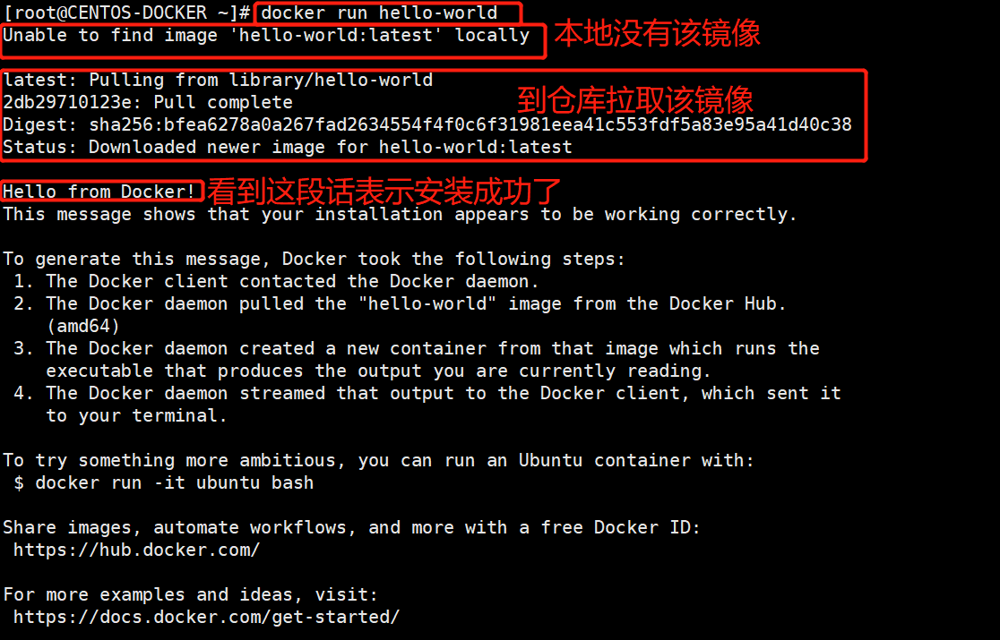

# 8. 查看下上一步下载的hello-world镜像
[root@CENTOS-DOCKER ~]# docker images
REPOSITORY    TAG       IMAGE ID       CREATED        SIZE
hello-world   latest    feb5d9fea6a5   6 months ago   13.3kB

# 卸载docker
1. 卸载依赖
yum remove docker-ce docker-ce-cli containerd.io
2. 删除资源
rm -rf /var/lib/docker # docker的默认资源路径
rm -rf /var/lib/containerd

~~~

### 阿里云镜像加速
~~~shell
sudo mkdir -p /etc/docker

sudo tee /etc/docker/daemon.json <<-'EOF'
{
    "registry-mirrors":["https://qiyb9988.mirror.aliyuncs.com"]
}
EOF

sudo systemctl daemon-reload

sudo systemctl restart docker

~~~

### docker run的运行流程
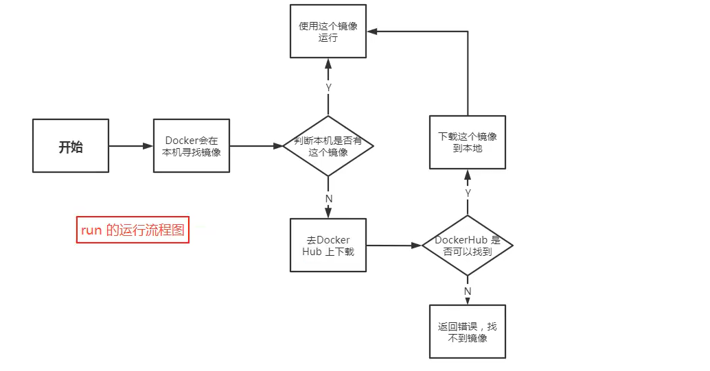

### 底层原理
* Docker是怎么工作的

Docker是一个Client-Server结构的系统，Docker的守护进程运行在主机上，通过Socket从客户端访问！

DockerServer接收到Docker Client的指令，就会执行这个命令

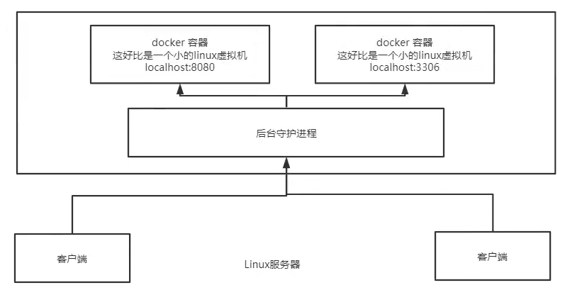

## Docker常用命令

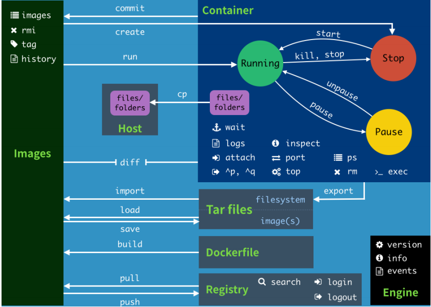

### 帮助命令

~~~shell

    docker version #显示docker的版本信息
    docker info # 显示docker的系统信息，包括镜像和容器的数量
    docker 命令 --help
    # https://docs.docker.com/reference/

~~~

### 镜像命令

docker image --help

* docker images 查看本地机器上的镜像信息
~~~shell
[root@CENTOS-DOCKER ~]# docker images
# 镜像的仓库地址 镜像的标签 镜像的ID 镜像创建时间 镜像的大小
REPOSITORY    TAG       IMAGE ID       CREATED        SIZE
hello-world   latest    feb5d9fea6a5   6 months ago   13.3kB
~~~
* docker search 搜索镜像
~~~shell
docker search 
[root@CENTOS-DOCKER ~]# docker search --help

Usage:  docker search [OPTIONS] TERM

Search the Docker Hub for images

Options:
  -f, --filter filter   Filter output based on conditions provided
      --format string   Pretty-print search using a Go template
      --limit int       Max number of search results (default 25)
      --no-trunc        Don't truncate output
~~~
* docker pull 下载镜像
~~~shell
docker pull 
[root@CENTOS-DOCKER ~]# docker pull nginx 
Using default tag: latest # 如果不写tag，默认就是latest
latest: Pulling from library/nginx 
c229119241af: Pull complete  # 分层下载，docker image的核心，联合文件系统
2215908dc0a2: Pull complete 
08c3cb2073f1: Pull complete 
18f38162c0ce: Pull complete 
10e2168f148a: Pull complete 
c4ffe9532b5f: Pull complete 
Digest: sha256:2275af0f20d71b293916f1958f8497f987b8d8fd8113df54635f2a5915002bf1 # 签名
Status: Downloaded newer image for nginx:latest
docker.io/library/nginx:latest # 真实地址

# 指定版本下载
docker pull nginx:perl

~~~

* docker rmi 删除镜像
~~~shell

docker rmi -f 容器ID #删除指定容器
docker rmi -f 容器ID1 容器ID2 容器ID3 ... # 删除多个容器
docker rmi -f ${docker images -aq} #删除全部容器
~~~

### 容器命令

   下载镜像后才能使用
~~~shell
    docker pull centos
~~~
* 新建容器并启动
~~~shell
    docker run [可选参数] image
    # 常用参数说明
    --name="NAME"       # 设置容器名
    -d                  # 以后台方式运行
    -it                 # 使用交互让是云翔，进入容器窗口
    -p                  # 指定容器端口
        # 指定容器端口的集中方式
        # -p 主机端口:容器端口
        # -p ip:主机端口:容器端口
        # -p 容器端口
        # 容器端口
    -P                  # 随机指定端口

    # 启动并进入容器
    docker run -it centos /bin/bash
~~~
* 退出容器
~~~shell
    # 从容器中退出
    exit #直接停止并退出
    ctrl+p+q # 退出不停止
~~~
* 列出当前正在运行的容器
~~~shell 
    docker ps

    -a      # 列出当前正在运行的容器+带出历史运行的容器
    -n=?    # 显示最近创建的容器,n后面表示个数
    -q      # 只显示容器的编号

[root@CENTOS-DOCKER docker]# docker ps
CONTAINER ID   IMAGE     COMMAND   CREATED   STATUS    PORTS     NAMES
[root@CENTOS-DOCKER docker]# docker ps -a
CONTAINER ID   IMAGE     COMMAND       CREATED         STATUS                       PORTS     NAMES
90c855e5ac99   centos    "/bin/bash"   4 minutes ago   Exited (127) 3 minutes ago             dazzling_feynman
~~~
* 删除容器
~~~shell
    docker rm          # 删除指定容器，不能删除运行中的容器
    docker rm -f       # 强制删除
    docker rm $(docker ps -aq)             # 删除全部容器
    docker ps -a -q | xargs docker rm       # 删除全部容器
~~~
* 启动和停止容器
~~~shell
    docker start 容器ID     # 启动容器
    docker restart 容器ID   # 重启容器
    docker stop 容器ID      # 停止正在运行的容器
    docker kill 容器ID      # 强制停止
~~~

###  其他常用命令

* 后台启动容器

~~~shell
# 命令 docker run -d 镜像
docker run -d centos
# 但是，docker ps -a 发现centos不在运行中

# 常见的坑，docker容器使用后台运行，就必须有一个前台进程，docker发现没有应用，就会自动停止
~~~

* 查看日志

~~~shell

docker logs

[root@CENTOS-DOCKER docker]# docker logs --help

Usage:  docker logs [OPTIONS] CONTAINER

Fetch the logs of a container

Options:
      --details        Show extra details provided to logs
  -f, --follow         Follow log output # 动态更新日志
      --since string   Show logs since timestamp (e.g. 2013-01-02T13:23:37Z) or relative (e.g. 42m for 42 minutes)
  -n, --tail string    Number of lines to show from the end of the logs (default "all")
  -t, --timestamps     Show timestamps #带时间戳
      --until string   Show logs before a timestamp (e.g. 2013-01-02T13:23:37Z) or relative (e.g. 42m for 42 minutes)

# 显示日志
docker logs -tf --tail 2 77136bd2904b

~~~

* 查看进程中的进程信息  
~~~shell

docker top 容器ID

~~~

* 查看容器的元数据信息
~~~Shell

[root@CENTOS-DOCKER docker]# docker inspect --help

Usage:  docker inspect [OPTIONS] NAME|ID [NAME|ID...]

Return low-level information on Docker objects

Options:
  -f, --format string   Format the output using the given Go template
  -s, --size            Display total file sizes if the type is container
      --type string     Return JSON for specified type

[root@CENTOS-DOCKER docker]# docker inspect d6fc46120639
[
    {
        "Id": "d6fc46120639f9ac507dc766604f7b7d73067d2b96aafbad8f893e1321d0d3f3",
        "Created": "2022-04-04T12:17:32.462427174Z",
        "Path": "/bin/bash",
        "Args": [],
        "State": {
            "Status": "running",
            "Running": true,
            "Paused": false,
            "Restarting": false,
            "OOMKilled": false,
            "Dead": false,
            "Pid": 8578,
            "ExitCode": 0,
            "Error": "",
            "StartedAt": "2022-04-04T12:17:32.828893993Z",
            "FinishedAt": "0001-01-01T00:00:00Z"
        },
        "Image": "sha256:5d0da3dc976460b72c77d94c8a1ad043720b0416bfc16c52c45d4847e53fadb6",
        "ResolvConfPath": "/var/lib/docker/containers/d6fc46120639f9ac507dc766604f7b7d73067d2b96aafbad8f893e1321d0d3f3/resolv.conf",
        "HostnamePath": "/var/lib/docker/containers/d6fc46120639f9ac507dc766604f7b7d73067d2b96aafbad8f893e1321d0d3f3/hostname",
        "HostsPath": "/var/lib/docker/containers/d6fc46120639f9ac507dc766604f7b7d73067d2b96aafbad8f893e1321d0d3f3/hosts",
        "LogPath": "/var/lib/docker/containers/d6fc46120639f9ac507dc766604f7b7d73067d2b96aafbad8f893e1321d0d3f3/d6fc46120639f9ac507dc766604f7b7d73067d2b96aafbad8f893e1321d0d3f3-json.log",
        "Name": "/pedantic_shirley",
        "RestartCount": 0,
        "Driver": "overlay2",
        "Platform": "linux",
        "MountLabel": "",
        "ProcessLabel": "",
        "AppArmorProfile": "",
        "ExecIDs": null,
        "HostConfig": {
            "Binds": null,
            "ContainerIDFile": "",
            "LogConfig": {
                "Type": "json-file",
                "Config": {}
            },
            "NetworkMode": "default",
            "PortBindings": {},
            "RestartPolicy": {
                "Name": "no",
                "MaximumRetryCount": 0
            },
            "AutoRemove": false,
            "VolumeDriver": "",
            "VolumesFrom": null,
            "CapAdd": null,
            "CapDrop": null,
            "CgroupnsMode": "host",
            "Dns": [],
            "DnsOptions": [],
            "DnsSearch": [],
            "ExtraHosts": null,
            "GroupAdd": null,
            "IpcMode": "private",
            "Cgroup": "",
            "Links": null,
            "OomScoreAdj": 0,
            "PidMode": "",
            "Privileged": false,
            "PublishAllPorts": false,
            "ReadonlyRootfs": false,
            "SecurityOpt": null,
            "UTSMode": "",
            "UsernsMode": "",
            "ShmSize": 67108864,
            "Runtime": "runc",
            "ConsoleSize": [
                0,
                0
            ],
            "Isolation": "",
            "CpuShares": 0,
            "Memory": 0,
            "NanoCpus": 0,
            "CgroupParent": "",
            "BlkioWeight": 0,
            "BlkioWeightDevice": [],
            "BlkioDeviceReadBps": null,
            "BlkioDeviceWriteBps": null,
            "BlkioDeviceReadIOps": null,
            "BlkioDeviceWriteIOps": null,
            "CpuPeriod": 0,
            "CpuQuota": 0,
            "CpuRealtimePeriod": 0,
            "CpuRealtimeRuntime": 0,
            "CpusetCpus": "",
            "CpusetMems": "",
            "Devices": [],
            "DeviceCgroupRules": null,
            "DeviceRequests": null,
            "KernelMemory": 0,
            "KernelMemoryTCP": 0,
            "MemoryReservation": 0,
            "MemorySwap": 0,
            "MemorySwappiness": null,
            "OomKillDisable": false,
            "PidsLimit": null,
            "Ulimits": null,
            "CpuCount": 0,
            "CpuPercent": 0,
            "IOMaximumIOps": 0,
            "IOMaximumBandwidth": 0,
            "MaskedPaths": [
                "/proc/asound",
                "/proc/acpi",
                "/proc/kcore",
                "/proc/keys",
                "/proc/latency_stats",
                "/proc/timer_list",
                "/proc/timer_stats",
                "/proc/sched_debug",
                "/proc/scsi",
                "/sys/firmware"
            ],
            "ReadonlyPaths": [
                "/proc/bus",
                "/proc/fs",
                "/proc/irq",
                "/proc/sys",
                "/proc/sysrq-trigger"
            ]
        },
        "GraphDriver": {
            "Data": {
                "LowerDir": "/var/lib/docker/overlay2/9bf308ce07ae4974735721e2412e23c352c2d75d67ede05d765d8ae7c0703256-init/diff:/var/lib/docker/overlay2/2d947d224c2d4f7902054ff10a28b1c331cc741d9416b4199cec75823d1e3a18/diff",
                "MergedDir": "/var/lib/docker/overlay2/9bf308ce07ae4974735721e2412e23c352c2d75d67ede05d765d8ae7c0703256/merged",
                "UpperDir": "/var/lib/docker/overlay2/9bf308ce07ae4974735721e2412e23c352c2d75d67ede05d765d8ae7c0703256/diff",
                "WorkDir": "/var/lib/docker/overlay2/9bf308ce07ae4974735721e2412e23c352c2d75d67ede05d765d8ae7c0703256/work"
            },
            "Name": "overlay2"
        },
        "Mounts": [],
        "Config": {
            "Hostname": "d6fc46120639",
            "Domainname": "",
            "User": "",
            "AttachStdin": true,
            "AttachStdout": true,
            "AttachStderr": true,
            "Tty": true,
            "OpenStdin": true,
            "StdinOnce": true,
            "Env": [
                "PATH=/usr/local/sbin:/usr/local/bin:/usr/sbin:/usr/bin:/sbin:/bin"
            ],
            "Cmd": [
                "/bin/bash"
            ],
            "Image": "centos",
            "Volumes": null,
            "WorkingDir": "",
            "Entrypoint": null,
            "OnBuild": null,
            "Labels": {
                "org.label-schema.build-date": "20210915",
                "org.label-schema.license": "GPLv2",
                "org.label-schema.name": "CentOS Base Image",
                "org.label-schema.schema-version": "1.0",
                "org.label-schema.vendor": "CentOS"
            }
        },
        "NetworkSettings": {
            "Bridge": "",
            "SandboxID": "4feeeed6bcbd913fb4ec052c3cb452fad2702e39be31fa1480f6e87320a60ab5",
            "HairpinMode": false,
            "LinkLocalIPv6Address": "",
            "LinkLocalIPv6PrefixLen": 0,
            "Ports": {},
            "SandboxKey": "/var/run/docker/netns/4feeeed6bcbd",
            "SecondaryIPAddresses": null,
            "SecondaryIPv6Addresses": null,
            "EndpointID": "9773bfa1ae0019206e88621cb5a4f987a127c36efb9409ab10d84a0c8473cc60",
            "Gateway": "172.17.0.1",
            "GlobalIPv6Address": "",
            "GlobalIPv6PrefixLen": 0,
            "IPAddress": "172.17.0.2",
            "IPPrefixLen": 16,
            "IPv6Gateway": "",
            "MacAddress": "02:42:ac:11:00:02",
            "Networks": {
                "bridge": {
                    "IPAMConfig": null,
                    "Links": null,
                    "Aliases": null,
                    "NetworkID": "739334525c5a4a3aa08be7d9339679c106b37038094028a5f2ff70b558dd801c",
                    "EndpointID": "9773bfa1ae0019206e88621cb5a4f987a127c36efb9409ab10d84a0c8473cc60",
                    "Gateway": "172.17.0.1",
                    "IPAddress": "172.17.0.2",
                    "IPPrefixLen": 16,
                    "IPv6Gateway": "",
                    "GlobalIPv6Address": "",
                    "GlobalIPv6PrefixLen": 0,
                    "MacAddress": "02:42:ac:11:00:02",
                    "DriverOpts": null
                }
            }
        }
    }
]

~~~

* 进入当前正在运行的容器
  
    * 我们通常容器都是使用后台方式运行的，需要进入容器修改一些配置

~~~shell

# 方式1：docker exec 参数 容器id

[root@CENTOS-DOCKER /] # docker exec --help

Usage:  docker exec [OPTIONS] CONTAINER COMMAND [ARG...]

Run a command in a running container

Options:
  -d, --detach               Detached mode: run command in the background
      --detach-keys string   Override the key sequence for detaching a container
  -e, --env list             Set environment variables
      --env-file list        Read in a file of environment variables
  -i, --interactive          Keep STDIN open even if not attached
      --privileged           Give extended privileges to the command
  -t, --tty                  Allocate a pseudo-TTY
  -u, --user string          Username or UID (format: <name|uid>[:<group|gid>])
  -w, --workdir string       Working directory inside the container

    # 进入容器
    docker exec -it d6fc46120639 /bin/bash

# 方式2：docker attach 容器ID

[root@CENTOS-DOCKER /]# docker attach --help

Usage:  docker attach [OPTIONS] CONTAINER

Attach local standard input, output, and error streams to a running container

Options:
      --detach-keys string   Override the key sequence for detaching a container
      --no-stdin             Do not attach STDIN
      --sig-proxy            Proxy all received signals to the process (default true)

# 两种方式的比较
docker exec         # 进入容器后开启一个新的终端，可以再里面操作（常用）
docker attach       # 进入容器正在执行的终端，不会启动新的进程

~~~

* 从容器内复制文件到本地
~~~shell

docker cp 容器ID:容器内的文件路径 本地文件路径

[root@CENTOS-DOCKER home]# docker cp --help

Usage:  docker cp [OPTIONS] CONTAINER:SRC_PATH DEST_PATH|-
	docker cp [OPTIONS] SRC_PATH|- CONTAINER:DEST_PATH

Copy files/folders between a container and the local filesystem

Use '-' as the source to read a tar archive from stdin
and extract it to a directory destination in a container.
Use '-' as the destination to stream a tar archive of a
container source to stdout.

Options:
  -a, --archive       Archive mode (copy all uid/gid information)
  -L, --follow-link   Always follow symbol link in SRC_PATH

docker cp 755555ede0a6:/home/joddon.txt /home/

~~~

### 总结
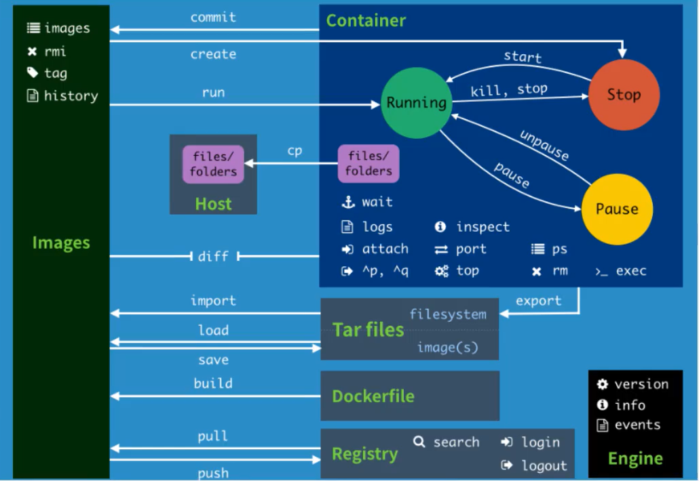

## 练习

### 安装Nginx

~~~shell

# 搜索
docker search nginx
# 下载
docker pull nginx 
# 启动
docker run -d --name nginx01 -p 3344:80 nginx
# 

~~~
端口暴露
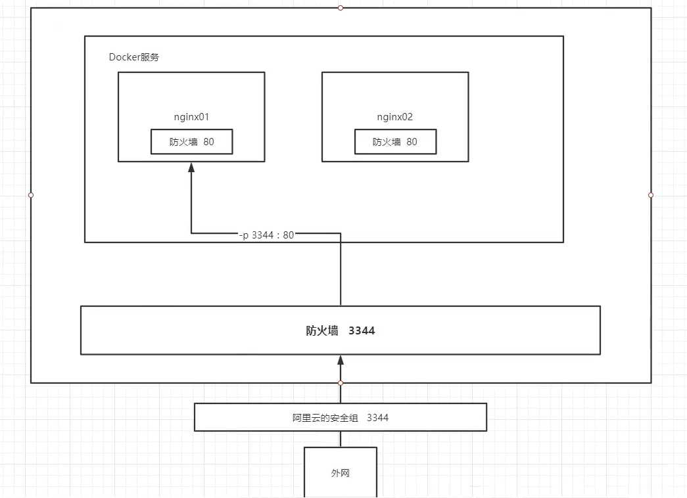

### 安装tomcat

~~~shell

docker pull tomcat

~~~

## 可视化

###  portainer

1. 安装

~~~shell

docker pull portainer/portainer

~~~

2. 运行

~~~shell

docker run -d -p 8088:9000 --restart=always -v /var/run/docker.sock:/var/run/docker.sock --privileged=true portainer/portainer

~~~

3. 连接

http://192.168.1.119:8088/#/auth

admin/12345678

4. 重置密码

* docker ps -a

* docker run --rm -v portainer_data:/data portainer/helper-reset-password
  

如果不行，就往下看

* docker inspect 98e830d3e97c
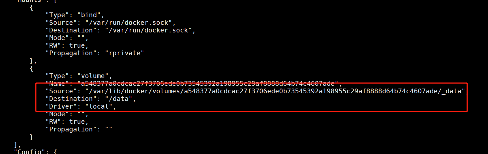

* docker run --rm -v /var/lib/docker/volumes/a548377a0cdcac27f3706ede0b73545392a198955c29af8888d64b74c4607ade/_data:/data portainer/helper-reset-password
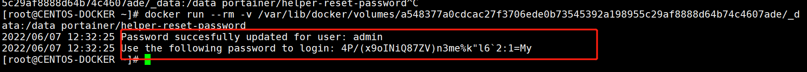

* docker start 

# Docker镜像详解

## 提交镜像

docker commit -m="提交的描述信息" -a="作者" 容器id 目标镜像名:TAG

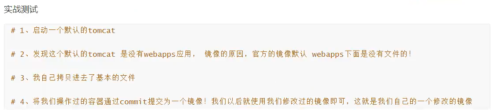

# 容器数据卷

## 什么是容器数据卷

## 测试

## 具名和匿名挂载
~~~shell

# 匿名挂载
-v 容器内路径

# 查看所有的 volume 的情况
[root@CENTOS-DOCKER ~]# docker volume ls
DRIVER    VOLUME NAME
local     a548377a0cdcac27f3706ede0b73545392a198955c29af8888d64b74c4607ade

# 这种就是匿名挂载，我们在 -v 只写了容器内的路径，没有写容器外的路径

# 具名挂载
-v 卷名:容器内路径

所有的docker容器内的卷，没有指定目录的情况下路径都是在/var/lib/docker/volumes

如何区分是具名挂载还是匿名挂载，还是指定路径挂载

匿名挂载        -v 容器内路径 
具名挂载        -v 卷名:容器内路径
指定路径挂载     -v /宿主机路径:容器内路径

~~~
* 拓展
~~~shell

# 通过 -v 容器内路径:ro rw 改变读写权限
ro readonly # 只读
rw read-write #  可读可写

# 一旦设置了权限，容器对挂载出来的内容就限定了
ro 说明这个路径只有通过宿主机来操作，容器内部是无法操作的

~~~

# DockerFile

* docker镜像的的构建文件

## 文件格式
~~~ shell
FROM centos
VOLUME ["volume01","volume02"]
CMD echo "---------end--------"
CMD /bin/bash
~~~

执行

~~~shell

docker build -f dockerfile1 -t /joddon/centos .

~~~

# Docker网络

