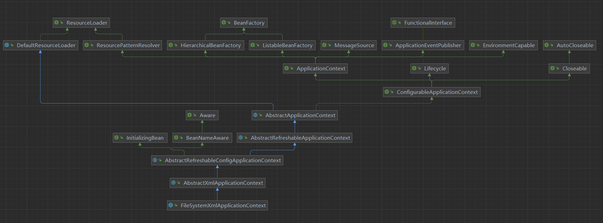

# Spring的设计理念和整体架构

## 1. Spring的各个子项目
打开spring的官方网站：https://spring.io/projects
1. Spring Boot
    Takes an opinionated view of building Spring applications and gets you up and running as quickly as possible.
    对构建Spring应用程序持坚定态度，并尽快使您启动和运行。
2. Spring Framework
    Provides core support for dependency injection, transaction management, web apps, data access, messaging and more.
    为依赖注入、事务管理、web应用程序、数据访问、消息传递等提供核心支持。
3. Spring Data
    Provides a consistent approach to data access – relational, non-relational, map-reduce, and beyond.
    为数据访问提供一致的方法——关系型、非关系型、map-reduce等等。
4. Spring Cloud
    Provides a set of tools for common patterns in distributed systems. Useful for building and deploying microservices.
    提供一组用于分布式系统中常见模式的工具。对于构建和部署微服务很有用。
5. Spring Cloud Data Flow
    An orchestration service for composable data microservice applications on modern runtimes.
    用于现代运行时可组合数据微服务应用程序的编排服务。
6. Spring Security
    Protects your application with comprehensive and extensible authentication and authorization support.
    通过全面且可扩展的身份验证和授权支持保护您的应用程序。
7. Spring Session
    Spring Session provides an API and implementations for managing a user’s session information.
    Spring Session提供了用于管理用户会话信息的API和实现。
8. Spring Integration
    Supports the well-known Enterprise Integration Patterns via lightweight messaging and declarative adapters.
    通过轻量级消息传递和声明性适配器支持著名的企业集成模式。
9. Spring HATEOAS
    Simplifies creating REST representations that follow the HATEOAS principle.
    简化了遵循HATEOAS原理的REST表示的创建。
10. Spring REST Docs
    Document RESTful services by combining hand-written documentation with auto-generated snippets produced with Spring MVC Test or REST Assured.
    通过将手写文档与Spring MVC Test或REST Assured生成的自动生成的片段结合起来，记录RESTful服务。
11. Spring Batch
    Simplifies and optimizes the work of processing high-volume batch operations.
    简化和优化处理批量生产的工作。
12. Spring AMQP
    Applies core Spring concepts to the development of AMQP-based messaging solutions.
    将Spring核心概念应用于基于AMQP的消息传递解决方案的开发。
13. pring for Android
    Provides key Spring components for use in developing Android applications.
    提供用于开发Android应用程序的关键Spring组件。
14. Spring CredHub
    Provides client-side support for storing, retrieving, and deleting credentials from a CredHub server running in a Cloud Foundry platform.
    提供客户端支持，以从Cloud Foundry平台中运行的CredHub服务器存储，检索和删除凭据。
15. Spring Flo
    A JavaScript library that offers a basic embeddable HTML5 visual builder for pipelines and simple graphs.
    一个JavaScript库，为管道和简单图形提供了基本的可嵌入HTML5可视生成器。
16. Spring for Apache Kafka
    Provides Familiar Spring Abstractions for Apache Kafka.
    为Apache Kafka提供熟悉的Spring抽象。
17. Spring LDAP
    Simplifies the development of applications using LDAP using Spring's familiar template-based approach.
    使用Spring熟悉的基于模板的方法简化使用LDAP的应用程序开发。
18. Spring Mobile
    Simplifies the development of mobile web apps through device detection and progressive rendering options.
    通过设备检测和渐进式渲染选项简化了移动Web应用程序的开发。
19. Spring Roo
    Makes it fast and easy to build full Java applications in minutes.
    使您可以在几分钟内快速轻松地构建完整的Java应用程序。
20. Spring Shell
    Makes writing and testing RESTful applications easier with CLI-based resource discovery and interaction.
    通过基于CLI的资源发现和交互，使编写和测试RESTful应用程序更加容易。
21. Spring Statemachine
    A framework for application developers to use state machine concepts with Spring applications.
    应用程序开发人员可以在Spring应用程序中使用状态机概念的框架。
22. Spring Vault
    Provides familiar Spring abstractions for HashiCorp Vault.
    为HashiCorp Vault提供熟悉的Spring抽象
23. Spring Web Flow
    Supports building web applications with controlled navigation such as checking in for a flight or applying for a loan.
    支持构建具有受控导航功能的Web应用程序，例如办理登机手续或申请贷款。
24. Spring Web Services
    Facilitates the development of contract-first SOAP web services.
    促进合同优先的SOAP Web服务的开发。

## 2. Spring的设计目标
1. Spring为开发者提供的是一个一站式的轻量级应用开发框架
2. Spring的设计理念，面向接口开发而不依赖于具体的产品实现

## 3. Spring的整体架构
<table style="text-align:center;">
	<tr>
	    <td rowspan="3">Spring AOP</td>
	    <td colspan="3">Spring事物处理</td>
	    <td colspan="3">spring应用</td>
	</tr>
	<tr>
	    <td colspan="2">Spring JDBC/ORM</td>
	    <td colspan="2">Spring MVC</td>
        <td colspan="2">Spring远端调用及其他支持</td>
	</tr>
	<tr>
	    <td colspan="6">spring IoC模块 (BeanFactory、应用上下文、各种支持实现)</td>
	</tr>
</table>

### 3.1. Spring IoC
1. 包含了最为基本的IoC容器和BeanFactory的接口的实现，不仅定义了IoC容器的基本接口（BeanFactory），也提供了一系列这个接口的实现，如XmlBeanFactory，为了让应用更方便的使用IOC容器，还需要在IOC容器的外围提供其他支持，包括Resource访问资源的抽象和定位等，所有这些都是Spring IoC模块的基本内容。
2. Spring 还这几了IoC容器的高级形态ApplicationContext应用上下文供用户使用。

### 3.2. Spring AOP 
1. Spring核心模块，围绕AOP的增强功能，Spring集成了AspectJ作为AOP的一个特定实现，同时还在JVM动态代理/CGLIB的基础上实现了一个AOP框架，作为Spring集成其他模块的工具。
2. 在这个模块中，Spring AOP实现了一个完成的建立AOP对象，实现AOP拦截器，直至实现各种Advice通知的过程。

### 3.3. Spring MVC
1. 这个模块以DispatcherServlet为中心，实现了MVC模式，包括怎样与web容器环境的集成，web请求的拦截、分发、处理和ModelAndView数据的返回，以及如何集成各种UI视图展现和数据展现，如PDF，Excel等，通过这个模块，可以完成Web的前段设计。

### 3.4. Spring JDBC/ORM
1. 对java JDBC封装，使数据库操作更加简洁，
2. 提供了JdbcTemplate作为模板
3. 提供了RDBMS的操作对象，使应用以更加面向对象的方式访问数据库
4. 还提供了对其他ORM工具的封装，如Hibernate，iBatis

### 3.5. Spring事务处理
1. 是一个通过Spring AOP实现自身功能增强的典型模块

### 3.6. Spring远端调用
spring为应用带来的一个好处就是能够应用解耦，一方面可以降低设计的复杂性，另一方面，可以在解耦以后将应用模块分布式地部署，从而通过系统整体的性能，在后一应用场景下就会用到Spring的远端调用，这种远端调用是通过Spring的封装从Spring应用之间的端到端调用，在这个过程中，通过Spring的封装，为应用屏蔽了各种通信和调用细节的实现，同时，通过这一层的封装，是应用可以通过选择各种不同的远端调用来实现，比如可以使用HTTP调用器（以HTTP协议为基础的），可以使用第三方的二进制通信实现Hession/Burlap，甚至分封装了传统Java技术中的RMI（Remote Method Invocation，远程方法调用）调用

# IoC容器的实现

# 容器和对象的创建流程

## 1. FileSystemXmlApplicationContext

## 2. IoC容器的初始化过程

1. BeanDefinition的Resource定位、
2. BeanDefinition的载入 
3. 注册三个过程

### 2.1. Resource定位

1. 指的是BeanDefinition的资源定位

### 2.2. BeanDefinition的载入

1. 这个载入过程就是把用户定义好的的Bean表示成IoC容器内部的数据结构，而这个容器内部的数据结构就时BeanDefinition

### 2.3. 注册
1. 通过调用BeanDefinitionRegistry接口的实现来完成的，这个注册过程把载入过程中解析得到的BeanDefinition向IoC容器中进行注册

