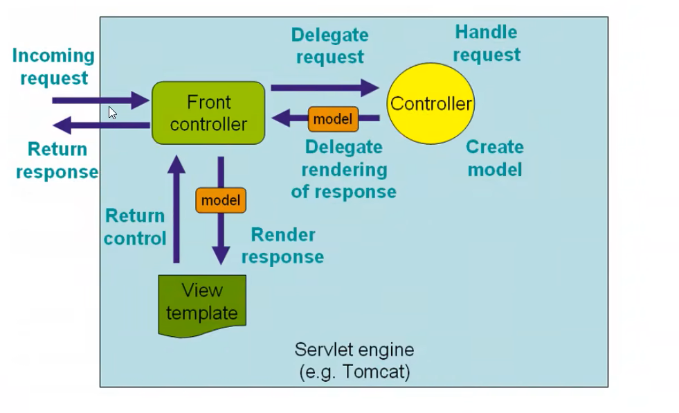
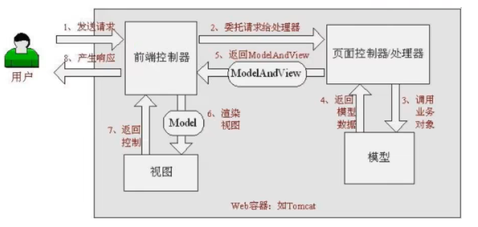
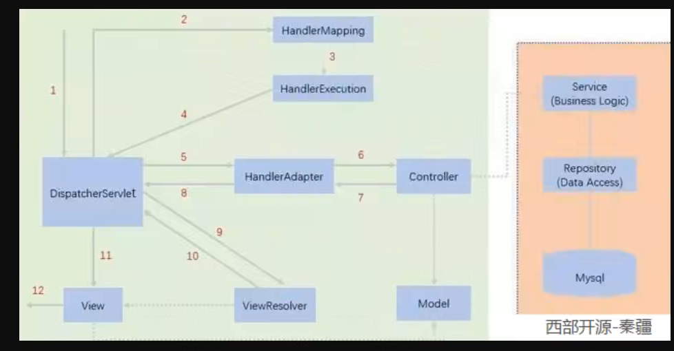
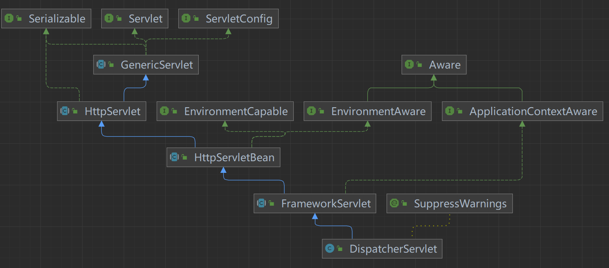

# SpringMvc

## 什么是SpringMvc

* Spring MVC是一个基于Java的实现了MVC设计模式的请求驱动类型的轻量级Web框架，通过把Model，View，Controller分离，将web层进行职责解耦，把复杂的web应用分成逻辑清晰的几部分，简化开发，减少出错，方便组内开发人员之间的配合

## 执行流程

1. DispatcherServlet表示前置控制器，是整个SpringMVC的控制中心。用户发出请求，
2. DispatcherServlet接收请求并拦截请求。我们假设请求的url为: http://localhost:8080/hello
3. HandlerMapping为处理器映射。DispatcherServlet调用HandlerMapping,HandlerMapping根据请求url查找Handler。
4. HandlerExecution表示具体的Handler,其主要作用是根据url查找控制器，如上url被查找控制器为：hello。
5. HandlerExecution将解析后的信息传递给DispatcherServlet,如解析控制器映射等。
6. HandlerAdapter表示处理器适配器，其按照特定的规则去执行Handler。
7. Handler让具体的Controller执行。
8. Controller将具体的执行信息返回给HandlerAdapter,如ModelAndView。
9. HandlerAdapter将视图逻辑名或模型传递给DispatcherServlet。
10. DispatcherServlet调用视图解析器(ViewResolver)来解析HandlerAdapter传递的逻辑视图名。
11. 视图解析器将解析的逻辑视图名传给DispatcherServlet。
12. DispatcherServlet根据视图解析器解析的视图结果，调用具体的视图。
13. 最终视图呈现给用户。

## DispatcherServlet

## 重定向和转发

* 请求方式分为转发、重定向 2 种，分别使用 forward 和 redirect 关键字在 controller 层进行处理。

### 转发
    
是将用户对当前处理的请求转发给另一个视图或处理请求，以前的 request 中存放的信息不会失效。

客户浏览器发送 http 请求，Web 服务器接受此请求，调用内部的一个方法在容器内部完成请求处理和转发动作，将目标资源发送给客户；在这里转发的路径必须是同一个 Web 容器下的 URL，其不能转向到其他的 Web 路径上，中间传递的是自己的容器内的 request。

在客户浏览器的地址栏中显示的仍然是其第一次访问的路径，也就是说客户是感觉不到服务器做了转发的。转发行为是浏览器只做了一次访问请求。

### 重定向
    
将用户从当前处理请求定向到另一个视图(例如 JSP)或处理请求，以前的请求(request)中存放的信息全部失效，并进入一个新的 request 作用域；

客户浏览器发送 http 请求，Web 服务器接受后发送 302 状态码响应及对应新的 location 给客户浏览器，客户浏览器发现是 302 响应，则自动再发送一个新的 http 请求，请求 URL 是新的 location 地址，服务器根据此请求寻找资源并发送给客户。

在这里 location 可以重定向到任意 URL，既然是浏览器重新发出了请求，那么就没有什么 request 传递的概念了。在客户浏览器的地址栏中显示的是其重定向的路径，客户可以观察到地址的变化。重定向行为是浏览器做了至少两次的访问请求。

## JSON
