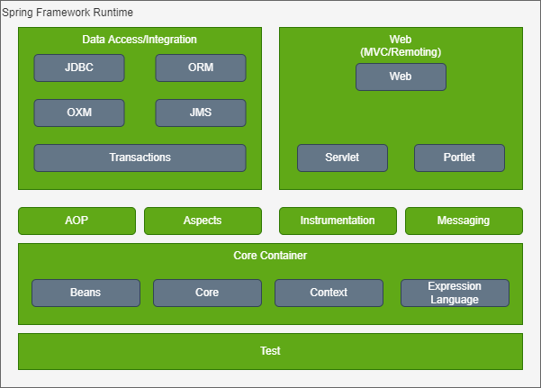

# Spring源码深度解析

## 1. Spring整体架构

### 1.1. 整体架构

Spring框架是一个分层架构，包含一系列的功能要素，大约分为20多个模块

[](drawio_repo/spring整体架构.drawio)

这些模块被总结为以下几个部分：

#### 1.1.1. Core Container

Core Container(核心容器)包含Core，Beans，Context，Expression Language等模块

* Core模块主要包含Spring框架基本的核心工具类。
* Beans模块包含访问配置文件、创建和管理bean以及进行Inversion of Control/Dependency Injection(Ioc/DI)操作相关的类
* Context模块是基于Core和Beans模块之上的，提供了一种类似于JNDI注册器的框架式的对象访问方法，Context模块继承了Beans模块的特性，为Spring核心提供了大量的扩展，添加了对国际化、事件传播、资源加载和对Context的透明创建的支持。Context模块同时也支持J2EE的一些特性，如EJB、JMX和基础的远程处理，ApplicationContext接口是Context模块的关键。
* Expression Language模块提供了强大的表达式语言，用于在运行时查询和操作对象。

#### 1.1.2. Data Access/Integration

Data Access/Integration包含JDBC、ORM、OXM、JMS和Transaction模块

* JDBC模块包含了Spring对JDBC数据访问进行封装的类
* ORM模块为对象-关系映射API，如JPA，JDO，Hibernate、ibatis等
* OXM模块提供了一个对Object/XML映射实现的抽象层，Object/XML映射实现包含JAXB、Castor、XMLBeans、JiBX和XStream
* JMS(Java Messaging Service)
* Transaction模块支持编程和声明性的事务管理。

#### 1.1.3. WEB
  
建立在应用程序上下文模块（ApplicationContext）之上，为基于Web的应用程序提供了上下文，web模块简化了处理大部分请求以及将请求参数绑定到域对象的工作，Web又分为一下几个模块

* WEB模块：提供了基础的面向Web的集成特性，如：文件上传、使用Web Listeners初始化IoC容器以及一个面向Web的应用上下文
* Web-servlet模块（web.servlet.jar）,包含了Spring的model-view-controller(MVC)实现
* Web-Struts模块，提供了对Struts的支持，注意该模块已经在spring 3.0中被废弃
* Web-Portlet模块，提供了用于Portlet环境和Web-Servlet模块的MVC的实现

#### AOP

AOP模块提供了一个面向切面编程的实现，Spring AOP模块为基于Spring的应用程序中的对象提供了事务管理服务，

* Aspects模块提供了对AspectJ的集成支持
* Instrumentation模块提供了class instrumentation支持和classloader实现，使得可以再特定的应用服务器上使用

#### Test

Test模块支持使用JUnit和TestNG对Spring组件进行测试


## 2. 容器的基本实现

### 2.1. 容器的基本用法

1. 定义bean
~~~java
    public class MyTest{
        private String  str = "test";

        public String getStr(){
            return str;
        }

        public String setStr(String str){
            this.str = str
        }
    }
~~~
2. 配置xml文件
~~~xml
<?xml version="1.0" encoding="UTF-8"?>
<beans xmlns="http://www.springframework.org/schema/beans"
       xmlns:xsi="http://www.w3.org/2001/XMLSchema-instance"
       xsi:schemaLocation="http://www.springframework.org/schema/beans http://www.springframework.org/schema/beans/spring-beans.xsd">

    <bean id="myTest" class="com.test.bean.MyTest"/>

</beans>
~~~
3. 使用容器

~~~java
public class BeanFactoryTest{

    public static void main(String[] args){
        BeanFactory bf = new XmlBeanFactory(new new ClassPathResource("beanFactoryTest.xml"));
        MyTest bean = (MyTest) bf.getBean("myTest");
        bean.getStr();
    }

}
~~~


### 2.2. Spring的结构组成

#### 2.2.1. 核心类分析

1. DefaultListableBeanFactory

DefaultListableBeanFactory是整个bean加载的核心部分，是Spring注册及加载bean的默认实现，

[](drawio_repo/DefaultListableBeanFactory.drawio)

1. XmlBeanDefinitionReader

XML

### 2.3. 容器基础XmlBeanFactory

Spring 3.1以后已经废弃了XmlBeanFactory这个类了

#### 2.3.1. 配置文件封装

Spring的配置文件读取是通过ClassPathResource进行封装的

~~~java
    BeanFactory factory = new XmlBeanFactory(new ClassPathResource("spring-ioc.xml"));
~~~

~~~java

    // XmlBeanFactory 构造函数

	public XmlBeanFactory(Resource resource) throws BeansException {
		this(resource, null);
	}

    public XmlBeanFactory(Resource resource, BeanFactory parentBeanFactory) throws BeansException {
		super(parentBeanFactory);
        // 真正加载资源的真正实现
		this.reader.loadBeanDefinitions(resource);
	}

~~~

深入看下其中的super(parentBeanFactory)，跟踪代码到AbstractAutowireCapableBeanFactory中，可以看到如下代码，重点需要关注下其中的ignoreDependencyInterface的作用：忽略指定接口的自动装配功能

~~~java
	public AbstractAutowireCapableBeanFactory() {
		super();
		ignoreDependencyInterface(BeanNameAware.class);
		ignoreDependencyInterface(BeanFactoryAware.class);
		ignoreDependencyInterface(BeanClassLoaderAware.class);
		if (NativeDetector.inNativeImage()) {
			this.instantiationStrategy = new SimpleInstantiationStrategy();
		}
		else {
			this.instantiationStrategy = new CglibSubclassingInstantiationStrategy();
		}
	}
~~~

#### 2.3.2. 加载Bean

XmlBeanFactory构造函数中````this.reader.loadBeanDefinitions(resource)````是整个资源记载的切入点

~~~java

    public XmlBeanFactory(Resource resource, BeanFactory parentBeanFactory) throws BeansException {
		super(parentBeanFactory);
        // 真正加载资源的真正实现
		this.reader.loadBeanDefinitions(resource);
	}
~~~
进入XmlBeanDefinitionReader类中
~~~java

	@Override
	public int loadBeanDefinitions(Resource resource) throws BeanDefinitionStoreException {
		// 将资源文件封装成EncodedResource
        // EncodedResource的作用主要就是对资源文件的编码进行处理
        return loadBeanDefinitions(new EncodedResource(resource));
	}

    public int loadBeanDefinitions(EncodedResource encodedResource) throws BeanDefinitionStoreException {
		Assert.notNull(encodedResource, "EncodedResource must not be null");
		if (logger.isTraceEnabled()) {
			logger.trace("Loading XML bean definitions from " + encodedResource);
		}

		// 通过属性来标识已经加载的资源
		Set<EncodedResource> currentResources = this.resourcesCurrentlyBeingLoaded.get();

		if (!currentResources.add(encodedResource)) {
			throw new BeanDefinitionStoreException(
					"Detected cyclic loading of " + encodedResource + " - check your import definitions!");
		}

		// 从encodedResource中获取已经封装的Resource对象，并从Resource中获取inputStream
		try (InputStream inputStream = encodedResource.getResource().getInputStream()) {
			// xml.sax 中的类
			InputSource inputSource = new InputSource(inputStream);
			// 如果encodedResource中设置了编码格式则使用，默认是没有设置的
			if (encodedResource.getEncoding() != null) {
				inputSource.setEncoding(encodedResource.getEncoding());
			}
			// 真正进行加载BeanDefinition的地方，开始进入核心逻辑
			return doLoadBeanDefinitions(inputSource, encodedResource.getResource());
		}
		catch (IOException ex) {
			throw new BeanDefinitionStoreException(
					"IOException parsing XML document from " + encodedResource.getResource(), ex);
		}
		finally {
			currentResources.remove(encodedResource);
			if (currentResources.isEmpty()) {
				this.resourcesCurrentlyBeingLoaded.remove();
			}
		}
	}


    protected int doLoadBeanDefinitions(InputSource inputSource, Resource resource)
			throws BeanDefinitionStoreException {

		try {
			// 获取Document
			Document doc = doLoadDocument(inputSource, resource);
			// 注册BeanDefinitions
			int count = registerBeanDefinitions(doc, resource);
			if (logger.isDebugEnabled()) {
				logger.debug("Loaded " + count + " bean definitions from " + resource);
			}
			return count;
		}
		catch (BeanDefinitionStoreException ex) {
			throw ex;
		}
		catch (SAXParseException ex) {
			throw new XmlBeanDefinitionStoreException(resource.getDescription(),
					"Line " + ex.getLineNumber() + " in XML document from " + resource + " is invalid", ex);
		}
		catch (SAXException ex) {
			throw new XmlBeanDefinitionStoreException(resource.getDescription(),
					"XML document from " + resource + " is invalid", ex);
		}
		catch (ParserConfigurationException ex) {
			throw new BeanDefinitionStoreException(resource.getDescription(),
					"Parser configuration exception parsing XML from " + resource, ex);
		}
		catch (IOException ex) {
			throw new BeanDefinitionStoreException(resource.getDescription(),
					"IOException parsing XML document from " + resource, ex);
		}
		catch (Throwable ex) {
			throw new BeanDefinitionStoreException(resource.getDescription(),
					"Unexpected exception parsing XML document from " + resource, ex);
		}
	}
~~~


### 2.4. 获取Xml的验证模式

Xml的验证模式保证了Xml文件的正确性，比较常用的验证模式有两种：DTD、XSD

#### 2.4.1. DTD与XSD的区别

DTD: Document Type Definition即文档类型定义，通过比较XML文档和DTD文件来看文档是否复合规范，元素标签是否使用规范、一个DTD文档一般包含：元素的定义规则、元素间关系的定义规则、元素可使用的属性、可使用的实体或者符号规则。

XSD：Xml Schemas语言就是XSD(Xml Schemas Definition)，Xml Schemas描述了Xml文档的结构。XML Schemas本身也是XML文档，

#### 2.4.2. 验证模式的读取

XmlBeanDefinitionReader通过getValidationModeForResource方法来获取xml文档的验证模式
~~~java
	protected int getValidationModeForResource(Resource resource) {
		int validationModeToUse = getValidationMode();
		if (validationModeToUse != VALIDATION_AUTO) {
			return validationModeToUse;
		}
		int detectedMode = detectValidationMode(resource);
		if (detectedMode != VALIDATION_AUTO) {
			return detectedMode;
		}
		// Hmm, we didn't get a clear indication... Let's assume XSD,
		// since apparently no DTD declaration has been found up until
		// detection stopped (before finding the document's root tag).
        // 嗯，我们没有得到明确的指示。。。让我们假设XSD，
        // 因为在检测停止之前（在找到文档的根标记之前）显然没有找到DTD声明
		return VALIDATION_XSD;
	}
~~~

### 2.5. 获取Doucument

XmlBeanDefinitionReader 中，通过documentLoader来加载Document，这里的documentLoader实际上就是DefaultDocumentLoader

~~~java
	@Override
	public Document loadDocument(InputSource inputSource, EntityResolver entityResolver,
			ErrorHandler errorHandler, int validationMode, boolean namespaceAware) throws Exception {

		DocumentBuilderFactory factory = createDocumentBuilderFactory(validationMode, namespaceAware);
		if (logger.isTraceEnabled()) {
			logger.trace("Using JAXP provider [" + factory.getClass().getName() + "]");
		}
		DocumentBuilder builder = createDocumentBuilder(factory, entityResolver, errorHandler);
		return builder.parse(inputSource);
	}
~~~

关注下 EntityResolver ，这里的EntityResolver是调用XmlBeanDefinitionReader中getEntityResolver获取到的值

~~~java

	protected EntityResolver getEntityResolver() {
		if (this.entityResolver == null) {
			// Determine default EntityResolver to use.
			ResourceLoader resourceLoader = getResourceLoader();
			if (resourceLoader != null) {
				this.entityResolver = new ResourceEntityResolver(resourceLoader);
			}
			else {
				this.entityResolver = new DelegatingEntityResolver(getBeanClassLoader());
			}
		}
		return this.entityResolver;
	}

~~~


#### EntityResolver用法

EntityResolver作用是项目本身就可以提供一个如何寻找DTD声明的方法，及有程序来实现DTD申明的过程


### 2.6. 解析及注册BeanDefinitions

当进过上述doLoadBeanDefinitions方法中获取到有Xml转换成的Document对象后，传入registerBeanDefinitions方法，开始解析及注册BeanDefinitions

~~~java

    public int registerBeanDefinitions(Document doc, Resource resource) throws BeanDefinitionStoreException {
		// 使用  DefaultBeanDefinitionDocumentReader 实例化 BeanDefinitionDocumentReader
		BeanDefinitionDocumentReader documentReader = createBeanDefinitionDocumentReader();
		// 在实例化BeanDefinitionReader的时候会将BeanDefinition传入，默认使用继承自DefaultListableBeanFactory的子类
		// 记录统计前BeanDefinition的数量
		int countBefore = getRegistry().getBeanDefinitionCount();
		// 加载并注册BeanDefinitions
		documentReader.registerBeanDefinitions(doc, createReaderContext(resource));
		// 返回本次注册的BeanDefinition的数量
		return getRegistry().getBeanDefinitionCount() - countBefore;
	}

~~~

重点是DefaultBeanDefinitionDocumentReader类中的 registerBeanDefinitions及doRegisterBeanDefinitions方法

~~~java

	public void registerBeanDefinitions(Document doc, XmlReaderContext readerContext) {
		this.readerContext = readerContext;
		doRegisterBeanDefinitions(doc.getDocumentElement());
	}

    protected void doRegisterBeanDefinitions(Element root) {
		// Any nested <beans> elements will cause recursion in this method. In
		// order to propagate and preserve <beans> default-* attributes correctly,
		// keep track of the current (parent) delegate, which may be null. Create
		// the new (child) delegate with a reference to the parent for fallback purposes,
		// then ultimately reset this.delegate back to its original (parent) reference.
		// this behavior emulates a stack of delegates without actually necessitating one.
		// 任何嵌套的＜beans＞元素都会导致该方法中的递归。
		// 为了正确地传播和保存＜beans＞default-*属性，
		// 请跟踪当前（父）委托，该委托可能为null。创建一个新的（子）委托，
		// 并引用父级以备回退，然后最终将 this.delegate 重置回其原始（父级）引用。
		// 这种行为模拟了一堆委托，而实际上不需要一个。
		BeanDefinitionParserDelegate parent = this.delegate;
		this.delegate = createDelegate(getReaderContext(), root, parent);

		if (this.delegate.isDefaultNamespace(root)) {
			String profileSpec = root.getAttribute(PROFILE_ATTRIBUTE);
			if (StringUtils.hasText(profileSpec)) {
				String[] specifiedProfiles = StringUtils.tokenizeToStringArray(
						profileSpec, BeanDefinitionParserDelegate.MULTI_VALUE_ATTRIBUTE_DELIMITERS);
				// We cannot use Profiles.of(...) since profile expressions are not supported
				// in XML config. See SPR-12458 for details.
				if (!getReaderContext().getEnvironment().acceptsProfiles(specifiedProfiles)) {
					if (logger.isDebugEnabled()) {
						logger.debug("Skipped XML bean definition file due to specified profiles [" + profileSpec +
								"] not matching: " + getReaderContext().getResource());
					}
					return;
				}
			}
		}

		preProcessXml(root);
		parseBeanDefinitions(root, this.delegate);
		postProcessXml(root);

		this.delegate = parent;
	}


	protected void parseBeanDefinitions(Element root, BeanDefinitionParserDelegate delegate) {
		if (delegate.isDefaultNamespace(root)) {
			NodeList nl = root.getChildNodes();
			for (int i = 0; i < nl.getLength(); i++) {
				Node node = nl.item(i);
				if (node instanceof Element ele) {
					if (delegate.isDefaultNamespace(ele)) {
                        // 解析默认元素
						parseDefaultElement(ele, delegate);
					}
					else {
                        // 解析自定义元素
						delegate.parseCustomElement(ele);
					}
				}
			}
		}
		else {
			delegate.parseCustomElement(root);
		}
	}
~~~


## 3. 默认标签的解析

上面讲解到了parseBeanDefinitions中对标签的解析分两种，本章重点学习默认标签的解析 parseDefaultElement

~~~
    private void parseDefaultElement(Element ele, BeanDefinitionParserDelegate delegate) {
		// 处理import标签
		if (delegate.nodeNameEquals(ele, IMPORT_ELEMENT)) {
			importBeanDefinitionResource(ele);
		}
		// 处理alias标签
		else if (delegate.nodeNameEquals(ele, ALIAS_ELEMENT)) {
			processAliasRegistration(ele);
		}
		// 处理bean标签 重要！！！
		else if (delegate.nodeNameEquals(ele, BEAN_ELEMENT)) {
			processBeanDefinition(ele, delegate);
		}
		// 处理beans标签
		else if (delegate.nodeNameEquals(ele, NESTED_BEANS_ELEMENT)) {
			// recurse
			doRegisterBeanDefinitions(ele);
		}
	}
~~~

### 3.1. 【核心】bean标签的解析与注册

解析罗中最为核心和重要的一步

~~~java

    protected void processBeanDefinition(Element ele, BeanDefinitionParserDelegate delegate) {
		//委托BeanDefinitionParserDelegate对元素进行解析，返回bdHolder，
		// 此时bdHolder中已经含有了我们xml中我们定义的属性
		BeanDefinitionHolder bdHolder = delegate.parseBeanDefinitionElement(ele);
		if (bdHolder != null) {
			bdHolder = delegate.decorateBeanDefinitionIfRequired(ele, bdHolder);
			try {
				// Register the final decorated instance.
				BeanDefinitionReaderUtils.registerBeanDefinition(bdHolder, getReaderContext().getRegistry());
			}
			catch (BeanDefinitionStoreException ex) {
				getReaderContext().error("Failed to register bean definition with name '" +
						bdHolder.getBeanName() + "'", ele, ex);
			}
			// Send registration event.
			getReaderContext().fireComponentRegistered(new BeanComponentDefinition(bdHolder));
		}
	}   

~~~

#### 解析BeanDefinition

这一步其实委托给了BeanDefinitionParserDelegate类的parseBeanDefinitionElement方法进行

~~~java 

	@Nullable
	public BeanDefinitionHolder parseBeanDefinitionElement(Element ele) {
		return parseBeanDefinitionElement(ele, null);
	}

    @Nullable
    public BeanDefinitionHolder parseBeanDefinitionElement(Element ele, @Nullable BeanDefinition containingBean) {
		// ID属性
		String id = ele.getAttribute(ID_ATTRIBUTE);
		// name属性,多个逗号拼接
		String nameAttr = ele.getAttribute(NAME_ATTRIBUTE);
		// 解析别名
		List<String> aliases = new ArrayList<>();
		if (StringUtils.hasLength(nameAttr)) {
			String[] nameArr = StringUtils.tokenizeToStringArray(nameAttr, MULTI_VALUE_ATTRIBUTE_DELIMITERS);
			aliases.addAll(Arrays.asList(nameArr));
		}

		// 如果没有id , 取别名的第一个作为beanName
		String beanName = id;
		if (!StringUtils.hasText(beanName) && !aliases.isEmpty()) {
			beanName = aliases.remove(0);
			if (logger.isTraceEnabled()) {
				logger.trace("No XML 'id' specified - using '" + beanName +
						"' as bean name and " + aliases + " as aliases");
			}
		}

		if (containingBean == null) {
			checkNameUniqueness(beanName, aliases, ele);
		}
		// 解析
		AbstractBeanDefinition beanDefinition = parseBeanDefinitionElement(ele, beanName, containingBean);
		if (beanDefinition != null) {
			if (!StringUtils.hasText(beanName)) {
				try {
					// 如果beanName不存在
					if (containingBean != null) {
						beanName = BeanDefinitionReaderUtils.generateBeanName(
								beanDefinition, this.readerContext.getRegistry(), true);
					}
					else {
						beanName = this.readerContext.generateBeanName(beanDefinition);
						// Register an alias for the plain bean class name, if still possible,
						// if the generator returned the class name plus a suffix.
						// This is expected for Spring 1.2/2.0 backwards compatibility.
						String beanClassName = beanDefinition.getBeanClassName();
						if (beanClassName != null &&
								beanName.startsWith(beanClassName) && beanName.length() > beanClassName.length() &&
								!this.readerContext.getRegistry().isBeanNameInUse(beanClassName)) {
							aliases.add(beanClassName);
						}
					}
					if (logger.isTraceEnabled()) {
						logger.trace("Neither XML 'id' nor 'name' specified - " +
								"using generated bean name [" + beanName + "]");
					}
				}
				catch (Exception ex) {
					error(ex.getMessage(), ele);
					return null;
				}
			}
			String[] aliasesArray = StringUtils.toStringArray(aliases);
			return new BeanDefinitionHolder(beanDefinition, beanName, aliasesArray);
		}

		return null;
	}


    @Nullable
	public AbstractBeanDefinition parseBeanDefinitionElement(
			Element ele, String beanName, @Nullable BeanDefinition containingBean) {

		this.parseState.push(new BeanEntry(beanName));

		// 解析class属性
		String className = null;
		if (ele.hasAttribute(CLASS_ATTRIBUTE)) {
			className = ele.getAttribute(CLASS_ATTRIBUTE).trim();
		}
		// 解析parent属性
		String parent = null;
		if (ele.hasAttribute(PARENT_ATTRIBUTE)) {
			parent = ele.getAttribute(PARENT_ATTRIBUTE);
		}

		try {
			// 创建用于承载属性的BeanDefinition，其实是AbstractBeanDefinition的子类GenericBeanDefinition
			AbstractBeanDefinition bd = createBeanDefinition(className, parent);
			// 解析bean的各种属性
			parseBeanDefinitionAttributes(ele, beanName, containingBean, bd);
			// 提取description
			bd.setDescription(DomUtils.getChildElementValueByTagName(ele, DESCRIPTION_ELEMENT));
			// 解析元数据
			parseMetaElements(ele, bd);
			// 解析lookup-method属性
			parseLookupOverrideSubElements(ele, bd.getMethodOverrides());
			// 解析replaced-method属性
			parseReplacedMethodSubElements(ele, bd.getMethodOverrides());
			// 解析构造函数参数
			parseConstructorArgElements(ele, bd);
			// 解析property子元素
			parsePropertyElements(ele, bd);
			// 解析Qualifier子元素
			parseQualifierElements(ele, bd);

			bd.setResource(this.readerContext.getResource());
			bd.setSource(extractSource(ele));

			return bd;
		}
		catch (ClassNotFoundException ex) {
			error("Bean class [" + className + "] not found", ele, ex);
		}
		catch (NoClassDefFoundError err) {
			error("Class that bean class [" + className + "] depends on not found", ele, err);
		}
		catch (Throwable ex) {
			error("Unexpected failure during bean definition parsing", ele, ex);
		}
		finally {
			this.parseState.pop();
		}

		return null;
	}

~~~

逐一解析一下上面的每个步骤

1. 创建用于属性承载的BeanDefinition 

~~~java

	protected AbstractBeanDefinition createBeanDefinition(@Nullable String className, @Nullable String parentName)
			throws ClassNotFoundException {

		return BeanDefinitionReaderUtils.createBeanDefinition(
				parentName, className, this.readerContext.getBeanClassLoader());
	}

~~~
这件事情委托给了BeanDefinitionReaderUtils的createBeanDefinition

~~~java

	public static AbstractBeanDefinition createBeanDefinition(
			@Nullable String parentName, @Nullable String className, @Nullable ClassLoader classLoader) throws ClassNotFoundException {

		GenericBeanDefinition bd = new GenericBeanDefinition();
		bd.setParentName(parentName);
		if (className != null) {
			if (classLoader != null) {
				bd.setBeanClass(ClassUtils.forName(className, classLoader));
			}
			else {
				bd.setBeanClassName(className);
			}
		}
		return bd;
	}

~~~

2. 解析各种属性

 主要包含一下属性
 1. scope
 2. abstract
 3. lazy-init
 4. autowire
 5. depends-on
 6. autowire-candidate
 7. primary
 8. init-method
 9. destroy-method
 10. factory-method
 11. factory-bean

3. 解析子元素mate

parseMetaElements

4. 


### 3.2. alias标签的解析

### 3.3. import标签的解析

### 3.4. 嵌入式beans标签的解析

## 4. 自定义标签解析

### 4.1. 自定义标签的使用

### 4.2. 自定义标签的解析

## 5. bean的加载

### 5.1. 加载步骤

1. 转换对应beanName
2. 尝试从缓存中加载单例
3. bean的初始化
4. 原型模式的依赖检查
5. 检测parentBeanFactory
6. 将存储XML配置文件的GemericBeanDefinition转换为RootBeanDefinition
7. 寻找依赖
8. 针对不同的scope进行bean的创建
9. 类型转换

### 5.2. FactoryBean的使用

### 5.3. 缓存中获取单例bean

### 5.4. 从Bean的实例中获取对象

### 5.5. 获取单例

### 5.6. 准备创建bean

### 5.7. 循环依赖问题

### 5.8. 创建bean

## 6. 容器的功能扩展


## AOP 

## 