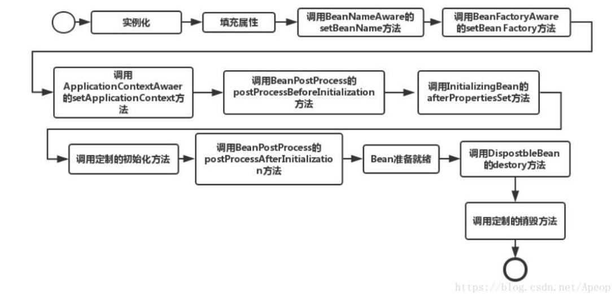

1. HashMap ConcurrentHashMap
   [HashMap](/java基础/java集合.md#hashmap)
   [ConcurrentHashMap](/java基础/java集合.md#concurrenthashmap)
2. spring bean的生命周期

3. spring IOC 容器的初始化流程
4. 基本排序算法的时间复杂度
5. 项目中有哪些亮点
6. Mysql索引的原理，为什么用B+树， explain 
7. 事务的隔离级别
8. 项目中有哪些可以优化的地方
9.  消息队列的幂等性问题
10. es查询的底层原理，倒排索引
11. 设计一个几十亿的白名单系统，支持白天查询，晚上更新
12. 抢红包，输入抢红包人数和金额数，要求：每人至少1元，一个人抢到的不能超过总金额的30%，每人的金额随机
13. 计算一句话中单词的出现次数